# 纯windows下的neovim快速配置过程

最新版说明在博客中
https://516518.xyz/2023/12/07/neovim%E5%BF%AB%E9%80%9F%E9%85%8D%E7%BD%AE/

由于github连接的问题，可能图片加载不出来，可以直接点下面的连接下载最新版的.zip解压即可

https://github.com/jiaxinaoliao/neovimBeginCpp/releases

解压之后打开REDME.md文件（推荐用typora打开或者notepads（alt+p开启markdown预览）也可以）即可查看


或者直接克隆仓库命令行中先`cd`到桌面或者好找的地方输入`git clone https://github.com/jiaxinaoliao/neovimBeginCpp.git`即可


虽然不是开箱即用但是也省略了大部分配置时间

下载之后进行简单的安装即可使用

纯windows环境下**不需要虚拟机**纯windows环境下

linux或者wsl也可以使用，小改动即可

macos应该也能兼容（没有试过）


## 1. 简介

win10或者win11都可以主要用于c\c++的学习使用（学习编程或者小项目）

**主要用于windows下的 学习编程  学习编程  学习编程 c\c++ c\c++ c\c++**

python之类的其他语言也可以（但是需要自己配置）

可以实现IDE的基本功能（编译、运行、调试、跳转、报错、提示等等）


**系统：**利用的win11的环境**windows11专业版21H2版本**

（22.10.3更新到22H2版本）

**终端：**最新版的**Windows Terminal**＋**powershell**

* 注意 ：Microsoft powershell和powershell不一样

PowerShell 7.x.x 是下一个长期服务 (LTS) 版本，基于 .NET 6.0 构建。

在windows和macos和linux都可以支持

**美化：** **oh-my-push**

编译用的gcc（或者clangd也可以）调试用的lldb

windows下lldb用的是MinGW64的llvm-mingw

**包管理器：scoop**

利用的工具是scoop类比于ubuntu下的apt，arch的pacman


**具体机型配置无所谓，不需要太好的性能八代i3的cpu也能带的动，占用资源超级小**


**总结：windows + windows terminal + powershell + oh-my-push + neovim + cpp（gcc + lldb）**

主要用于C/C++其他语言也可以，前端、python、java等也可以，需要小改动


## 2. 环境安装

win10和win11差不多都可以兼容


### 2.1 下载配置文件

首先下载仓库(https://github.com/shuangshuangbb/neovimBeginCpp/releases)打开网址

打不开github的话可以考虑用fastgithub进行加速，之后下载就行

windows直接下载压缩包之后解压放在一边（方便的位置如桌面配置之后可以删除）

下载最新版的zip


在主页也可以下载


### 2.2 配置终端设置

微软商店下载最新版本**Windows Terminal**和**Powershell**（直接去商店搜索安装即可）

打开下载的配置文件夹里面有一个字体的文件夹里面有Inconsolata LGC Bold Nerd Font Complete Mono Windows Compatible.ttf字体双击打开安装即可，或者自行去(https://www.nerdfonts.com/)官网下载nerd fonts的自己喜欢的字体

22.10.3换字体了Code New Roman Bold Nerd Font Complete Windows Compatible.otf也在文件夹里面打开安装就行

之后打开windows terminal以下简称wt

打开wt的设置，在设置中打开配置JSON文件如图


在配置文件夹中打开wt+pwsh配置文件的文件夹里面有一个**windowsterminal 配置.txt**文件将其中的内容复制**替换**原本的JSON配置文件

之后保存关闭即可，再次打开wt如果改变说明设置成功，标签栏默认隐藏（alt+z可以打开打开标签栏）如果不习惯也可以在设置->启动->启动模式中的启动模式改为别的即可

也可以在wt的设置中打开默认值->外观


之后根据自己的喜好设置透明度或者背景等，也可以更改其他nerd fonts字体

设置完成之后wt就可以投入使用了

可以用win+r输入wt快速打开和用cmd类似可以理解为cmd的一个超集


### 2.3 Scoop包管理器

scoop是windows下的一个强大的包管理器可以方便快速的安装软件


#### 2.3.1 scoop安装

安装scoop很简单只需要在powershell中输入一条指令

`iwr -useb get.scoop.sh | iex`即可自动安装

但是默认是在C盘安装所以在运行之前先要更改地址

并且要让powershell可以执行脚本需要输入

`Set-ExecutionPolicy -ExecutionPolicy RemoteSigned -Scope CurrentUser`

回车即可

之后依次输入下面的**两条指令**'D:\ScoopApp\Scoop'单引号内部的地址可以更改其他的不要动

```powershell
$env:SCOOP='D:\ScoopApp\Scoop'
[Environment]::SetEnvironmentVariable('SCOOP', $env:SCOOP, 'User')
```

第一条指令没有问题第二条指令也一样单引号内的地址可以更改可能需要管理员身份右键wt以管理身份运行即可

```powershell
$env:SCOOP_GLOBAL='D:\ScoopApp\GlobalScoopApps' [Environment]::SetEnvironmentVariable('SCOOP_GLOBAL', $env:SCOOP_GLOBAL,'Machine')
```

输入上两条指令之后再输入`iwr -useb get.scoop.sh | iex`即可开始安装scoop了

安装完成之后在'D:\ScoopApp\Scoop'的地方会有一个scoop的文件夹里面会有

- apps——所有通过scoop安装的软件都在里面。
- buckets——管理软件的仓库，用于记录哪些软件可以安装、更新等信息，默认添加`main`仓库，主要包含无需GUI的软件，可手动添加其他仓库或自建仓库，具体在[推荐软件仓库](https://zhuanlan.zhihu.com/write#推荐软件仓库)中介绍。
- cache——软件下载后安装包暂存目录。
- persit——用于储存一些用户数据，不会随软件更新而替换。
- shims——用于软链接应用，使应用之间不会互相干扰，实际使用过程中无用户操作不必细究。

scoop有很多功能可以自行上网查看，这里只用几个最基本的需要用到的

- install——安装软件。
- uninstall——卸载软件。
- update——更新软件。可通过`scoop update *`更新所有已安装软件，或通过`scoop update`更新所有软件仓库资料及Scoop自身而不更新软件。

比如需要安装git只需要在powershell中输入命令`scoop install git`即可

scoop + 命令 + 软件名称

 卸载的话就用`scoop uninstall git`


#### 2.3.2 安装之后

安装之后用`scoop update`进行更新

之后用`scoop bucket add 仓库名 `添加仓库

常用的有以下几个

```powershell
main
extras
versions
nightlies
nirsoft
php
nerd-fonts
nonportable
java
games
jetbrains
```

咱们需要用的默认的main和extras可以根据自己需要添加，如：

```powershell
scoop bucket add main

scoop bucket add extras

scoop bucket add java
```

main是默认的extras里面有大量的常用的软件java的就是提供java的一些工具

添加仓库之后用`scoop update *`更新所有软件

之后开始安装软件


这里推荐用一个`scoop install aria2`用来加速下载的

如果报错的话用下面的命令关闭aria2

```powershell
scoop config aria2-enabled false
```

同理改成true即可开启

```powershell
scoop config aria2-enabled true
```


用`scoop list`可以查看已经安装的程序

之后记住scoop install 和scoop uninstall就可以了其他的命令功能可以上官网自行查看这里用不到


## 3. 程序安装

### 1. zip

   首先安转一些小工具

   ```powershell
   先把neovim安装上
   scoop install neovim
   
   scoop install git
   scoop install 7zip
   scoop install aria2
   scoop install sudo
   scoop install wget
   scoop install unzip
   scoop install gzip
   scoop install ripgrep
   scoop install stylua
   ```

   

### 2. nodejs

   需要nodejs的环境

   ```powershell
   scoop install nodejs
   之后用node --version和npm --version检查安装版本
   输出版本号说明安装成功
   ```

   windows的话可能需要重启一下环境变量才会生效

   重启之后用npm --version查看输出版本号说明安装成功

   之后用npm安装一下wsl-open`npm install -g wsl-open`

   以后wsl的话用的到


### 3. fd-find

   fd-find（`npm install -g fd-find`）

   + 需要node.js环境
   + 可以用`scoop install fd`之后在neovim里面`:checkhealth`一下看看

   windows的话用`scoop install fd`即可


### 4. lazygit

   git管理器`scoop install lazygit`


### 5. 安装python

   windows的话直接去官网下载安装程序运行安装程序即可

   可以参考这个

   [全网最详细的Python安装教程（Windows） - 知乎 (zhihu.com)](https://zhuanlan.zhihu.com/p/344887837)

   主要就是安装python添加环境变量打开powershell之后输入python --version输出版本号书名成功了

或者用scoop安装也可以

   

### 6. python的环境

   需要在安装完Python之后

   `sudo pip3 install --upgrade pynvim`


### 7. mingw64下载（这里用gcc（编译）+lldb（调试））

#### 7.1 mingw64编译

   可以到官网直接下载

   [Downloads - MinGW-w64](https://www.mingw-w64.org/downloads/)

也可以不用下载

这个配置文件夹里面（已经移动到另一个仓库llvm-mingw）直接复制出来之后添加环境变量即可

怎么添加环境变量后文有说，可以先复制出来一会一起添加，添加完要重启才能生效


#### 7.2 lldb调试

gcc的话用gdb调试体验不是很好所以这里用lldb进行调试


配置文件夹内有一份**lldb和gdb快速使用.md**有一些基本的lldb和gdb的使用方法可以参考一下，也可以直接去官网查看文档


lldb是llvm的windows的话可以借用库一个是gnu的一个是msvc的就是微软的

这个是gnu的

配置文件夹中也有可以直接复制出来使用就行

   [Releases · mstorsjo/llvm-mingw (github.com)](https://github.com/mstorsjo/llvm-mingw/releases)

   

ucrt更通用i686是32位x86_64是64位根据自己电脑下载有macos和ubuntu的版本

这里用的windows直接下载最后

这个就可以了


下载之后解压放在D盘或者其他盘里面记住路径

可以用文件夹里面的跳过这步

之后添加系统环境变量，直接win+i打开设置然后搜索环境变量


搜索打开系统环境变量


点击path->编辑


之后先点**新建**然后点**浏览**

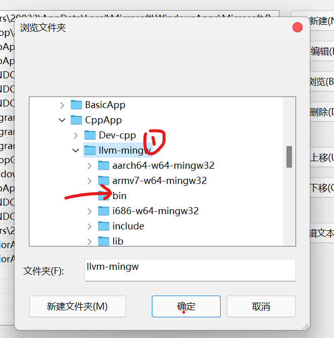

在浏览文件夹中找到llvm-mingw文件夹点击bin目录

之后一路确定即可

顺便把mingw的也添加进来但是要在llvm-mingw的上面（顺序一定不能弄错）


llvm-mingw用的是gnu的库可以用`clang -v`来查看


msvc就是vs的链接库llvm-win默认用的就是vs的

gnu就是mingw的库llvm-mingw默认用的就是gnu的

msvc的好处是，在终端支持中文显示，但是在neovim内会utf-8乱码（个人觉得不影响-在终端使用方便）

llvm-mingw默认用的gnu的库，utf-8在vim和终端中都是英文不会乱码

**gnu和msvc二选一即可**


**window的话建议用gnu**

用mingw的的话编译c++需要用g++

在nvim文件夹内的lua文件夹下keybindings.lua的最后

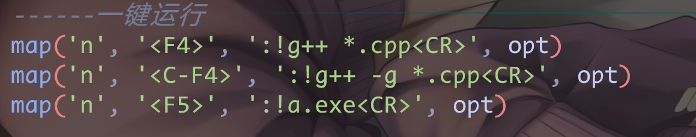

大概四百行左右的位置F4是编译如果想用clang就把F4后面的g++改成clang++即可

第二行是Ctrl+F4是调试之前的编译如需调试可以先用Ctrl+F4

c文件就用clang或者gcc

可以用`:400`命令或者快捷键`400gg`快速跳转到四百行就可以看见了

或者java改成javac等等都可以自行安排


\<F4\>一键编译之后用快捷键tt（中）或tb（右）或tc（下）打开一个终端窗口（位置不同）

用编译好的.exe的名称回车即可运行（或者F5在vim中运行预览一下效果）

powershell的格式是.\a.exe也可以输入文件(.exe)名称如`a`之后按\<TAB\>自动补全也可以

或者用-o改名如`g++ hello.cpp -o test.exe`即可编译生成hello.exe文件

之后`hello`按\<TAB\>自动补全`.\hello.exe`回车运行输出结果

默认按\<F5\>\<F4\>的名称为a.exe


#### 7.3 结合

这里使用的是gcc的编译器，clang也可以，看个人选择（windows下推荐用gcc）

clang的提示会更好mac的话默认用的clang的

windows的话gcc的兼容性会更好

但是要注意环境变量的顺序mingw的要在llvm-mingw的上面


到这里基本所有需要的程序就都已经安装完毕了


#### 7.4 UTF-8（windows改为utf-8）

在设置中找到区域设置

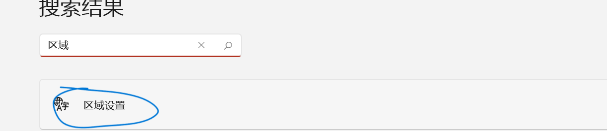

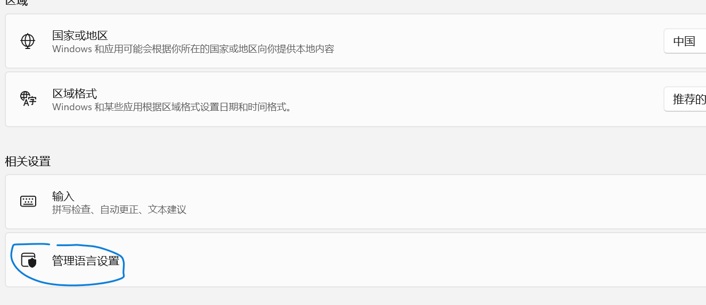

找到语言管理设置

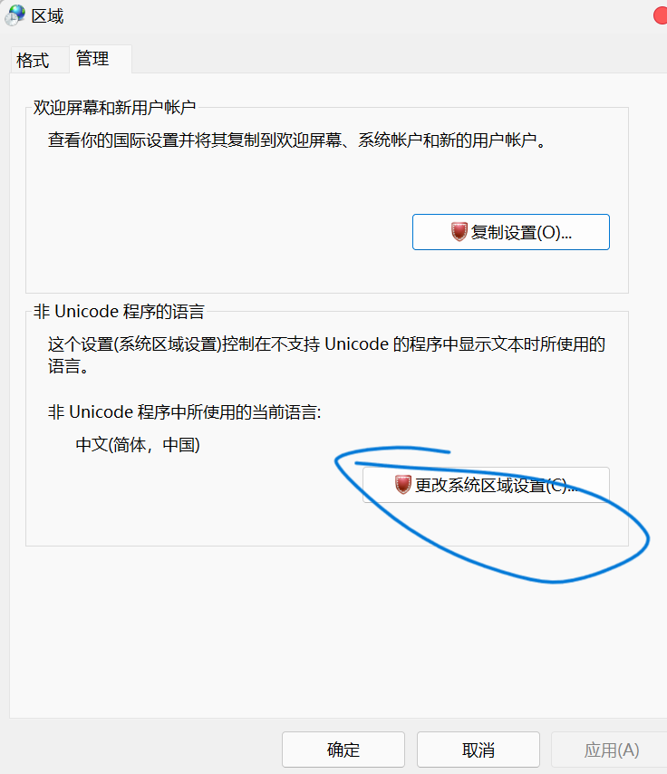

选择更改系统区域设置

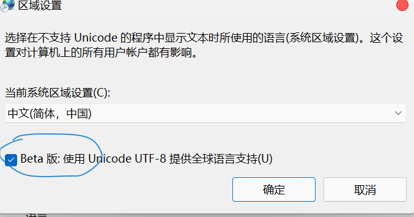

选用utf-8之后确定即可，需要重启电脑


### 8. 之后加的[gokcehan](https://github.com/gokcehan)/**[lf](https://github.com/gokcehan/lf)**

   类似于linux下的lf终端下的资源管理器

   直接到girhub上下载windows的版本`lf-windows-adm64`直接下载之后解压

   或者直接用这个配置文件夹中的

   文件夹中的是64位的windows的如果需要可以自行下载

   放在c盘以外的地方之后添加到环境变量中（需要重启一下）

   在终端中用lf即可打开


和vim操作差不多jk上下移动选择hl左右文件夹e用记事本打开，l打开q退出

windows的兼容性不是很好只是用来浏览用的


## 4. 运行neovim

将配置文件夹中的nvim文件夹复制粘贴到C盘C:\用户\用户名称\AppData\Local

或者用环境变量

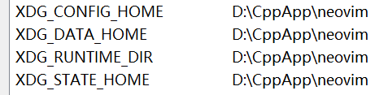

添加系统环境变量可以把配置文件夹移动到D:盘

整个文件夹复制进来（linux下的可以用.config文件夹）

之后在wt中打开neovim用nvim回车即可

第一次打开会自动安装packer插件管理器不用管等待安装完成即可

如果没有成功查看一下网络打开fastgithub

安装完成之后在neovim里面用:PackerSync命令进行安装插件

安装插件也许要可以连接上github用fastgithub或者代理也可以

全都安装不上就是网络问题

如果有一两个安装不上重新运行:PackerSync即可


全部安装好后就可以直接使用了如果有报错可以在neovim中用:CheckHealth检查一下

却少什么不能用报错error可以warning

如果报错看看缺少什么安装一下即可


### 4.1 补充

这个配置用了比如markdown的lsp需要`scoop install marksman`还有lua的lsp需要`scoop install lua-language server`


## 5. 自定义改动

在配置文件中nvim->lua->**keybindings.lua**文件包含快捷键以及注释可以自行更改


上述没有用到oh-my-push如果需要的话可以去微软商店下载安装

或者百度查找微软商店安装的话需要多安装几次确保安装没有问题

之后在powershell中用notepad 打开配置文件

`notepad $PORFILE`打开配置文件

将配置文件夹中的**Microsoft.PowerShell_profile.ps1**打开全部复制粘贴到里面

有一个带注释的.ps1的配置文件有具体说明

使用的时候用不带注释的会快

然后保存关闭在powershell中运行`.$PROFILE`加载一下即可


在oh-my-push中`Get-PoshThemes`可以查看所有主题

选一款自己喜欢的记住名字

之后用`notepad $PORFILE`打开配置文件将圈出来的地方改为自己喜欢的主题的名字即可

保存关闭后用`.$PROFILE`重新加载


可以方向键的右键->补全历史命令用ctrl+->部分补全


在nvim->lua->plugin-config->**dashboard.lua**可以更改自己喜欢的开机界面


都可以更改，样式会显示最后一个把最后一个删了或更改即可


至此全部配置完成可以将下载的配置文件夹删除了

可以实现代码补全，跳转，提示以及编译

调试的话用的vimspector但是没有配置完全

这里直接用的lldb去进行调试也是不错的后续有机会会更新


由于水平有限只能手动安装程序，有实力的选手可以自己写一个安装脚本一键安装


注：由于github连接问题可能加载不了图片所以所有的截图都放在了单独的文件夹中下载之后就能看了


[精通 VIM ，此文就够了 - 知乎 (zhihu.com)](https://zhuanlan.zhihu.com/p/68111471)

可以看看快速了解一下vim以及tmux


新增主题catppuccin/nvim还可以晚上看不错


想改的话可以在主题设置中将第一行取消注释`require('colorschme')`

将第二行注释掉就可以更改了改为gruvbox


或者在colorscheme.lua文件中更改自己喜欢的主题

tokyonight（星星也很高）和catppuccin/nvim效果差不多可以去看官方文档


### 5.1 starship+terminal+busybox

由于oh-my-posh启动速度太慢所以改为starship也可以起到美化作用并有参数提示提升速度，当然喜欢oh-my-posh主题的话也可以不换只是启动慢一点，不介意的话没有任何问题，可以去官网参考一下配置

[配置 | Starship](https://starship.rs/zh-cn/config/)

可以在windows Terminal中用`notepad $PORFILE`打开配置文件

`#Invoke-Expression (&starship init powershell)`将第二行的#去注释把第一行注释掉就行，starship的配置文件放在C:\Users\用户名\ .config文件夹下创建一个名为starship.toml的文件或者直接复制粘贴配置文件夹中的文件

可以参考官网更更改


## 6. 快捷键设置

快捷键的话在~nvim\lua下面的keybindings.lua文件中

配置文件夹中有个人按键说明的说明文档可以自行对照

https://github.com/jiaxinaoliao/neovimBeginCpp/blob/main/%E4%B8%AA%E4%BA%BA%E6%8C%89%E9%94%AE%E8%AF%B4%E6%98%8E.md


## 7. 补充

### 1. 不用go语言的话

添加了go语言的gopls但是安装需要设置一下

或者不用go语言的话在配置文件夹nvim/lua/lsp/setup.lua将

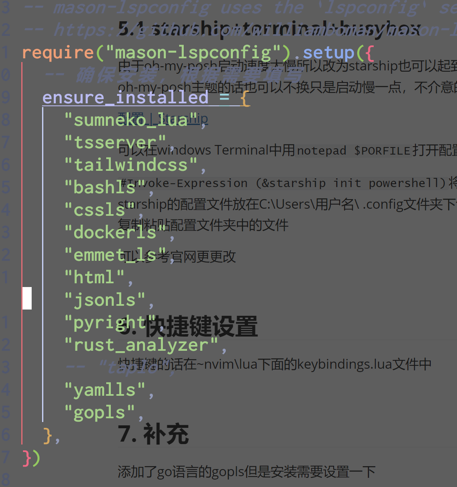

最后的gopls用`-- gopls`注释掉就可以了

### 用go语言的话

需要修改系统环境变量

运行

1. ```go env -w GO111MODULE=on```
2. ```go env -w GOPROXY=https://goproxy.io,direct```


或者新建一个环境变量如下

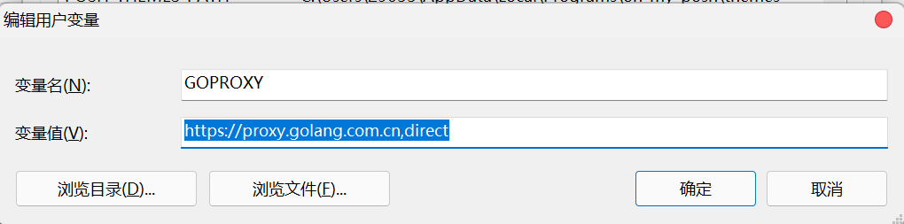

之后确定，windows尽量重启一下

之后就可以自动安装了

要不然安装gopls的时候会报错


## 8. neovim里面使用gdb调试

利用的是nvim-dap的插件

安装说明在这儿

[C C Rust (gdb via vscode cpptools) · mfussenegger/nvim-dap Wiki (github.com)](https://github.com/mfussenegger/nvim-dap/wiki/C-C---Rust-(gdb-via--vscode-cpptools))

vscode-cpptools的下载在这

[Releases · microsoft/vscode-cpptools (github.com)](https://github.com/microsoft/vscode-cpptools/releases)

下载vscode-cpptools之后

在配置文件夹~/nvim/lua/dap/nvim-dap/cpp.lua(C语言和C++都用这一个就可以了)

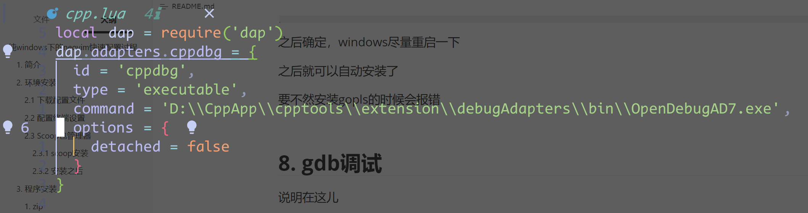

将command改为自己刚刚下载的路径即可

```cpp
F6 打断点
Ctrl+F5 开始调试
Shift+F5 停止调试
```


调试的时候如果需要使用gdb命令需要加前缀`-ecec`如a打断点`dap> -exec b hello.cpp : 6`


## 9. clang-format（cpp的自定义格式化）

在本仓库配置的~\nvim\lua\lsp\formatter.lua文件中

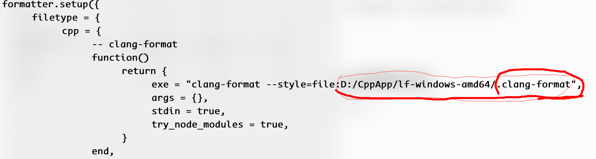

在这里将冒号后面的地址替换为自己的.clang-format配置文件地址

注意这里精确到文件.clang-format而不是文件夹


配置文件的写法可以去官网查看

https://clang.llvm.org/docs/ClangFormatStyleOptions.html

也可以去本仓库的 **‘clang-format配置’** 文件夹中查看（精简版）


## 10 windows下fzf的使用

这里直接用`scoop install fzf`的方式进行安装，fzf是一个非常好用的模糊搜索的工具，可以直接去github看一看官方的文档

安装好后在终端里面输入fzf就可以使用了

利用cd命令可以快速跳转到指定的文件夹，但是cd只能是跳转到文件夹不能是文件所以这里加一个..返回上一级就行了比如：`cd “$（fzf）\..”`即可实现快速搜索跳转了或者`vim $(fzf)`即可快速打开文件

fzf在windows下的配置，在环境变量中新建一个名为`FZF_DEFAULT_OPTS`值为`--layout=reverse --preview 'bat --style=numbers --color=always --line-range :500 {}'`代码预览需要bat可以用scoop安装z`
