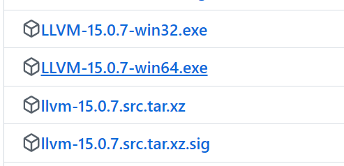

# clang-format自定义配置

## 1. 下载安装

clang-formant的下载可以直接去githut搜索llvm/llvm-project

下载对应的llvm即可或者下载clang-tools的包将clang-format提取出来即可




## 2. clang-format的配置

### 2.1 language 编程语言
```yaml
# 语言: None, Cpp, Java, JavaScript, ObjC, Proto, TableGen, TextProto
Language: Cpp
```


### 2.2 BaseOnStyle 基础风格

基于什么风格改动无需设置所有

```yaml
BasedOnStyle: LLVM|Google|Chromium|Mozilla|WebKit|Microsoft|GNU
```


### 2.3  AccessModifierOffset 访问性修饰符偏移

```yaml
# 访问说明符(public、private等)的偏移(缩进或者对齐)
AccessModifierOffset:	-4
```
这个是相对于原来已有的缩进而言：

```cpp
template <typename type> //模板定义
// template <class type>  较老的实现
class stack //定义一个模板类
{
private: //私有是默认属性，可省略
    //类声明中无法给没有分配空间的变量赋值（只是一起声明了一类变量）
    //某些常量或者静态常量变量（含有存储空间）则可以初始化
    int var;
}
```
原来的缩进是4个空白字符，这个表明在原来缩进4个字符的情况下偏移量，即回退4个字符，那相当于不缩进了。


### 2.4 AlignAfterOpenBracket 开括号后的对齐
```yaml
# 开括号(开圆括号、开尖括号、开方括号)后的对齐: Align, DontAlign, AlwaysBreak(总是在开括号后换行)
AlignAfterOpenBracket: Align
```

+ Align，在开括号之后对齐变量
```yaml
someLongFunction(argument1,
                 argument2);
```

+ DontAlign， 不对齐，换行后使用ContinuationIndentWidth。

```yaml
someLongFunction(argument1,
    argument2);
```

+ AlwaysBreak，一行放不下时，总是在一个开括号之后换行。

```yaml
someLongFunction(
    argument1, argument2);
```

+ BlockIndext，一行放不下时，总是在一个开括号之后换行，且在新行关闭尾括号。仅限于圆括号。

```yaml
someLongFunction(
    argument1, argument2
)
```


### 2.5 AlignArrayOfStructures 对齐结构体数组

当数组的列数相等时，会对齐每行的文本。

+ Left，左对齐列：

  ```yaml
  struct test demo[] =
  {
    {56, 23,    "hello"},
    {-1, 93463, "world"},
    {7,  5,     "!!"   }
  };
  ```

+ Right，右对齐列：

  ```yaml
  struct test demo[] =
  {
    {56,    23, "hello"},
    {-1, 93463, "world"},
    { 7,     5,    "!!"}
  };
  ```

+ 使用None表示不用对齐。


### 2.6 AlignConsecutiveAssignments 对齐连续赋值
# 连续赋值时，对齐所有等号
```
AlignConsecutiveAssignments: true
```


下面的格式是连续赋值：

```
int a            = 1;
int somelongname = 2;
double c         = 3;
```

该选项有两种生效方法，低版本只支持指定固定的模式，如下面其中一种：

```
#配置一个参数：None - Consecutive - AcrossEmptyLines - AcrossComments - AcrossEmptyLinesAndComments
AlignConsecutiveAssignments: AcrossEmptyLinesAndComments
```

最新版本支持分别指定属性，包括额外对混合元素符(+=等)的支持:

```
AlignConsecutiveAssignments:
  Enabled: true
  AcrossEmptyLines: true
  AcrossComments: true
  AlignCompound: true
  PadOperators: true
```

bool Enabled: true默认的连续赋值对齐在以下的情况下生效：

```
int a            = 1;
int somelongname = 2;
double c         = 3;

int aaaa : 1;
int b    : 12;
int ccc  : 8;

int         aaaa = 12;
float       b = 23;
std::string ccc;
```

bool AcrossEmptyLines可以跨越空白行进行对齐

```
true:
int a            = 1;
int somelongname = 2;
double c         = 3;

int d            = 3;

false:
int a            = 1;
int somelongname = 2;
double c         = 3;

int d = 3;
```

bool AcrossComments可以跨越注释行进行对齐

```
true:
int d    = 3;
/* A comment. */
double e = 4;

false:
int d = 3;
/* A comment. */
double e = 4;
```

bool AlignCompound混合运算符+=会对齐于=（仅限于连续赋值)

```
true:
a   &= 2;
bbb  = 2;

false:
a &= 2;
bbb = 2;
```

bool PadOperators混合运算符填补对齐到所有左值的最右边边界。(仅限于连续赋值)

```
true:
a   >>= 2;
bbb   = 2;

a     = 2;
bbb >>= 2;

false:
a >>= 2;
bbb = 2;

a     = 2;
bbb >>= 2;
```

### 2.7 AlignConsecutiveBitFields 位段对齐
主要用于结构体位段的对齐，如下：

```
struct aa {
    int test : 4;
    int b    : 5;
    int c    : 8;
};
```

其支持以下属性：

```
None - Consecutive - AcrossEmptyLines - AcrossComments - AcrossEmptyLinesAndComments
```

其设置方法和属性与AlignConsecutiveAssignments一致。

```
AlignConsecutiveBitFields: AcrossEmptyLinesAndComments
#或者
AlignConsecutiveBitFields:
  Enabled: true
  AcrossEmptyLines: true
  AcrossComments: true
```

### 2.8 AlignConsecutiveDeclarations 连续声明对齐
可以对齐变量等连续声明的语句。

```
int         aaaa = 12;
float       b    = 23;
std::string ccc;
const char  hexdigits[] = "0123456789abcdef";
void        Ipv6_deal(const uint16_t *a);

int main(const uint16_t *a, const uint16_t *k) { ... }
```

需要注意，这个方法配置最好不要跨过空白行，因为容易把函数定义也给对齐了。

其支持以下属性：

```
None - Consecutive - AcrossEmptyLines - AcrossComments - AcrossEmptyLinesAndComments
```

其设置方法和属性与AlignConsecutiveAssignments一致。

```
AlignConsecutiveDeclarations: AcrossComments
#或者
AlignConsecutiveDeclarations:
  Enabled: true
  AcrossEmptyLines: false
  AcrossComments: true
```

### 2.9 AlignConsecutiveMacros 连续宏定义对齐

```
#define SHORT_NAME       42
#define LONGER_NAME      0x007f
#define EVEN_LONGER_NAME (2)
#define foo(x)           (x * x)
#define bar(y, z)        (y + z)
```

需要注意，这个方法配置最好不要跨过空白行，因为空白行可以用来做段分割符。

其支持以下属性：

```
None - Consecutive - AcrossEmptyLines - AcrossComments - AcrossEmptyLinesAndComments
```

其设置方法和属性与AlignConsecutiveAssignments一致。

```
AlignConsecutiveMacros: AcrossComments
#或者
AlignConsecutiveMacros:
  Enabled: true
  AcrossEmptyLines: false
  AcrossComments: true
```

### 2.10 AlignEscapedNewlines 对齐分割语法行的斜杠符\
有三个选项：DontAlign、Left、Right

左对齐，是尽可能的向左边对齐。

```
true:
#define A   \
  int aaaa; \
  int b;    \
  int dddddddddd;
```

右对齐是对齐到列的最右边：

```
#define A                      \
  int aaaa;                                                                    \
  int b;                                                                       \
  int dddddddddd;
```

### 2.11 AlignOperands 竖直对齐表达式的操作数
竖直对齐二元表达式或者三元表达式操作数。

可用选项有：DontAlign，Align，AlignAfterOperators

对齐操作符是在需要换行时来起作用的，如下：

```
int aaa = bbbbbbbbbbbbbbb +
          ccccccccccccccc;
```

如果指定BreakBeforeBinaryOperators，那么操作符+也会被换行。

```
int aaa = bbbbbbbbbbbbbbb
          + ccccccccccccccc;
```

AlignAfterOperators选项是当BreakBeforeBinaryOperators被设置时，会将操作符对齐：

```
int aaa = bbbbbbbbbbbbbbb
        + ccccccccccccccc;
```

### 2.12 AlignTrailingComments 对齐尾部注释
旧版本是bool值，直接使用true或者false。(16版本才执行下面的语法)

True等价于，Always + OverEmptyLines: 0。

```
AlignTrailingComments:
  Kind: Always
  OverEmptyLines: 1
```

Kind的值可以选择为：Leave，Always，Never。

leave保留不做格式化：

```
int a;    // comment
int ab;       // comment

int abc;  // comment
int abcd;     // comment
```

Always对齐尾部注释：

```
int a;  // comment
int ab; // comment

int abc;  // comment
int abcd; // comment
```

Never不对齐尾部注释，但是应用其他的格式化手段，如缩进。

```
int a; // comment
int ab; // comment

int abc; // comment
int abcd; // comment
```

OverEmptyLines是跨越的空白行数，超过这个行数的注释不会对齐(分别对齐自身所属段)。

```
int a;  // these are

int ab; // aligned


int abcdef; // but this isn't
```

### 2.13 AllowAllArgumentsOnNextLine 允许参数在下一行上
如果函数调用或带括号的初始化列表不在一行中，则允许将所有参数放到下一行，即使BinPackArguments为false。

```
AllowAllArgumentsOnNextLine: true
```

```
true:
callFunction(
    a, b, c, d);

false:
callFunction(a,
             b,
             c,
             d);
```

### 2.14 AllowAllConstructorInitializersOnNextLine 已弃用
See NextLine of PackConstructorInitializers.

### 2.15 AllowAllParametersOfDeclarationOnNextLine 允许声明的参数在下一行上
函数声明的参数无法放在一行上，允许将所有的变量放在下一行上，尽管BinPackParametersisfalse。

```
true:
void myFunction(
    int a, int b, int c, int d, int e);

false:
void myFunction(int a,
                int b,
                int c,
                int d,
                int e);
```

 ### 2.16 AllowShortBlocksOnASingleLine 允许短语法块在单行上
根据情况，while (true) { continue;}可以放在单行上。

可以是以下值：Never，Empty，Always。

Never从不合并块到单行上。

```
while (true) {
}
while (true) {
  continue;
}
```

Empty只合并空块到单行上。

```
while (true) {}
while (true) {
  continue;
}
```


Always总是合并短块到单行上。

```
while (true) {}
while (true) { continue; }
```


### 2.17 AllowShortEnumsOnASingleLine 允许短枚举在单行上

```
true:
enum { A, B } myEnum;

false:
enum {
  A,
  B
} myEnum;
```


### 2.18 AllowShortFunctionsOnASingleLine 允许短函数在单行上
根据情况，int f() { return 0;}可以被放在单行上。

可以选择以下值：None，InlineOnly，Empty，Inline，ALL。

None从不合并函数到单行。

InlineOnly仅合并被定义在类里面的短函数，与Inline区别在于不含外部顶级定义的空函数。

```
class Foo {
  void f() { foo(); }
};
void f() {
  foo();
}
void f() {
}
```

Empty只合并空函数。

```
void f() {}
void f2() {
  bar2();
}
```

Inline合并被定义在类里面的短函数，以及空函数。

```
class Foo {
  void f() { foo(); }
};
void f() {
  foo();
}
void f() {}
```

All合并所有合适的短函数在单行上。

```
class Foo {
  void f() { foo(); }
};
void f() { bar(); }
```


### 2.19 AllowShortIfStatementsOnASingleLine 允许if块在单行上
只对没有括号的语句块起作用，如if (a) return;

有以下的选项:Never，WithoutElse，OnlyFirstIf，AllIfsAndElse

Never从不把if块放在单行上。

```
if (a)
  return;

if (b)
  return;
else
  return;

if (c)
  return;
else {
  return;
}
```

WithoutElse，仅在没有else语句时才会把if放在单行上。

```
if (a) return;

if (b)
  return;
else
  return;

if (c)
  return;
else {
  return;
}
```

OnlyFirstIf只把第一个if语句放在单行，后续的else if和else都不会放在单行上。

```
if (a) return;

if (b) return;
else if (b)
  return;
else
  return;

if (c) return;
else {
  return;
}
```

AllIfsAndElse总是把短语句放在单行上。

```
if (a) return;

if (b) return;
else return;

if (c) return;
else {
  return;
}
```


### 2.20 AllowShortLambdasOnASingleLine 允许短匿Lambda函数在单行上
只针对形式auto lambda []() {return 0;}。

有以下选项：None，Empty，Inline，All。

None从不合并。

Empty只合并空的Lambda函数。

```
auto lambda = [](int a) {};
auto lambda2 = [](int a) {
    return a;
};
```

Inline，当Lambda函数作为变量时，合并在单行上。

```
auto lambda = [](int a) {
    return a;
};
sort(a.begin(), a.end(), []() { return x < y; });
```

All合并所有适合的Lambda表达式在单行上。

```
auto lambda = [](int a) {};
auto lambda2 = [](int a) { return a; };
```


### 2.21 AllowShortLoopsOnASingleLine 允许合并短循环到单行上
当配置为true时，形式while (true) continue会被放在单行上。

### 2.22 AlwaysBreakAfterDefinitionReturnType 函数定义返回类型换行风格
该选项已经弃用.

None，返回类型之后自动断行， PenaltyReturnTypeOnItsOwnLine需要考虑在内。
All，总是在返回类型后断行。
TopLevel总是在顶级函数的返回类型处断行。
2.23 AlwaysBreakAfterReturnType 函数声明的返回类型换行风格
有以下的选项：None，All，TopLevel，AllDefinitions，TopLevelDefinitions

None在返回类型之后自动断行， PenaltyReturnTypeOnItsOwnLine需要考虑在内。

```
class A {
  int f() { return 0; };
};
int f();
int f() { return 1; }
```

All总是在返回类型之后断行.

```
class A {
  int
  f() {
    return 0;
  };
};
int
f();
int
f() {
  return 1;
}
```

TopLevel在顶级函数顶级返回类型处断行。

```
class A {
  int f() { return 0; };
};
int
f();
int
f() {
  return 1;
}
```

AllDefinitions在函数定义的返回类型处断行。

```
class A {
  int
  f() {
    return 0;
  };
};
int f();
int
f() {
  return 1;
}
```

TopLevelDefinitions在顶级函数定义的返回类型处断行。

```
class A {
  int f() { return 0; };
};
int f();
int
f() {
  return 1;
}
```


### 2.24 AlwaysBreakBeforeMultilineStrings 多行字符串断行
在多行字符串字面量时之前断行。

如下(只有当字符串需要换行时，才会生效)：

```
true:                                  false:
aaaa =                         vs.     aaaa = "bbbb"
    "bbbb"                                    "cccc";
    "cccc";
```


2.25 AlwaysBreakTemplateDeclarations 模板声明断行
有三个选项：No，MultiLine，Yes

No不会强制在模板声明处断行，需要考虑PenaltyBreakTemplateDeclaration。

```
template <typename T> T foo() {
}
template <typename T> T foo(int aaaaaaaaaaaaaaaaaaaaa,
                            int bbbbbbbbbbbbbbbbbbbbb) {
}
```

MultiLine仅在接下来的函数/类声明参数需要跨行时才会在模板处断行。

```
template <typename T> T foo() {
}
template <typename T>
T foo(int aaaaaaaaaaaaaaaaaaaaa,
      int bbbbbbbbbbbbbbbbbbbbb) {
}
```

Yes总是在模板声明之后进行断行。

```
template <typename T>
T foo() {
}
template <typename T>
T foo(int aaaaaaaaaaaaaaaaaaaaa,
      int bbbbbbbbbbbbbbbbbbbbb) {
}
```


### 2.26 AttributeMacros 属性宏
应该被解释为属性/限定符而不是标识符的字符串向量。这对于语言扩展或静态分析器注释非常有用。

下面是一个配置的例子：

```
x = (char *__capability)&y;
int function(void) __ununsed;
void only_writes_to_buffer(char *__output buffer);
```


.clang-format配置文件，可以被配置成下面这样：

```
  AttributeMacros: ['__capability', '__output', '__ununsed']
  #或者
  AttributeMacros: 
  
    - __capability
    - __output
    - __ununsed
```


### 2.27 BinPackArguments 装箱变量

  如果为false，函数调用变量要么都在同一行上，要么每个变量都独自在一行。

如果true，则会把变量合理打包放在一行上，显得更紧凑。

```
true:
void f() {
  f(aaaaaaaaaaaaaaaaaaaa, aaaaaaaaaaaaaaaaaaaa,
    aaaaaaaaaaaaaaaaaaaaaaaaaaaaaaaaaaaaaaaaaaa);
}

false:
void f() {
  f(aaaaaaaaaaaaaaaaaaaa,
    aaaaaaaaaaaaaaaaaaaa,
    aaaaaaaaaaaaaaaaaaaaaaaaaaaaaaaaaaaaaaaaaaa);
}
```


### 2.28 BinPackParameters 装箱声明参数
如果false，函数声明的参数或者函数定义的参数要么在同一行上，要么每个变量都独自在一行。

如果true，则会把变量合理打包放在一行上，显得更紧凑。

```
true:
void f(int aaaaaaaaaaaaaaaaaaaa, int aaaaaaaaaaaaaaaaaaaa,
       int aaaaaaaaaaaaaaaaaaaaaaaaaaaaaaaaaaaaaaaaaaa) {}

false:
void f(int aaaaaaaaaaaaaaaaaaaa,
       int aaaaaaaaaaaaaaaaaaaa,
       int aaaaaaaaaaaaaaaaaaaaaaaaaaaaaaaaaaaaaaaaaaa) {}
```


2.29 BitFieldColonSpacing 位段列的空白风格
可选以下值：Both，None，Before，After

both在:号每边都增加一个空白。

```
unsigned bf : 2;
```


None不加任何空白，除了AlignConsecutiveBitFields需要之外。

```
unsigned bf:2;
```


Before仅在:号之前添加空白。

```
unsigned bf :2;
```


After仅在:之后添加空白，除了AlignConsecutiveBitFields需要在前面添加空白之外。

```
unsigned bf: 2;
```


### 2.30 BraceWrapping 大括号换行风格
控制单独的大括号换行情况。

如果breakbeforebrace设置为BS_Custom，则使用它来指定应该如何处理每个独立的大括号情况。否则，它将被忽略。

```
# Example of usage:

BreakBeforeBraces: Custom
BraceWrapping:
  AfterEnum: true
  AfterStruct: false
  SplitEmptyFunction: false
```


以下是具体的属性设置。

bool AfterCaseLabel，对case后面的大括号换行。

```
false:                                true:
switch (foo) {                vs.     switch (foo) {
  case 1: {                             case 1:
    bar();                              {
    break;                                bar();
  }                                       break;
  default: {                            }
    plop();                             default:
  }                                     {
}                                         plop();
                                        }
                                      }
```


bool AfterClass类定义换行。

```
true:
class foo
{};

false:
class foo {};
```


AfterControlStatement，对语句if/for/while/switch/...的换行风格控制。

Never在控制条件语句之后从不换行。

```
if (foo()) {
} else {
}
for (int i = 0; i < 10; ++i) {
}
```


MultiLine只在一个多行控制语句之后换行。

```
if (foo && bar &&
    baz)
{
  quux();
}
while (foo || bar) {
}
```


Always在控制语句之后总是换行。

```
if (foo())
{
} else
{}
for (int i = 0; i < 10; ++i)
{}
```


bool AfterEnum枚举定义后大括号换行。

```
true:
enum X : int
{
  B
};

false:
enum X : int { B };
```


bool AfterFunction在函数定义之后大括号换行。

```
true:
void foo()
{
  bar();
  bar2();
}

false:
void foo() {
  bar();
  bar2();
}
```


bool AfterNamespace命名空间后换行。

```
true:
namespace
{
int foo();
int bar();
}

false:
namespace {
int foo();
int bar();
}
```


bool AfterObjCDeclaration在ObjC定义之后换行，@autoreleasepool 和 @synchronized 块根据AfterControlStatement标志换行。

bool AfterStruct结构体定义之后换行。

```
true:
struct foo
{
  int x;
};

false:
struct foo {
  int x;
};
```


bool AfterUnion联合定义之后换行。

```
true:
union foo
{
  int x;
}

false:
union foo {
  int x;
}
```


bool AfterExternBlockextern声明之后换行。

```
true:
extern "C"
{
  int foo();
}

false:
extern "C" {
int foo();
}
```


bool BeforeCatch在catch之前换行。

```
true:
try {
  foo();
}
catch () {
}

false:
try {
  foo();
} catch () {
}
```


bool BeforeElse在else之前换行。

```
true:
if (foo()) {
}
else {
}

false:
if (foo()) {
} else {
}
```


bool BeforeLambdaBody在Lambda表达式块之前换行。

```
true:
connect(
  []()
  {
    foo();
    bar();
  });

false:
connect([]() {
  foo();
  bar();
});
```


bool BeforeWhile在while之前换行。

```
true:
do {
  foo();
}
while (1);

false:
do {
  foo();
} while (1);
```


bool IndentBraces对换行的大括号缩进。

bool SplitEmptyFunction如果为false，空函数体可以放在单行上。此选项仅在函数的左大括号已经被换行的情况下使用，即设置了AfterFunction大括号换行模式，并且函数不应该放在单行上(根据AllowShortFunctionsOnASingleLine和构造函数格式选项)。

```
false:          true:
int f()   vs.   int f()
{}              {
                }
```


bool SplitEmptyRecord如果为false，空记录(例如类、结构或联合)主体可以放在单行上。此选项仅在记录的开始大括号已经被换行的情况下使用，即设置了AfterClass(用于类)大括号换行模式。

```
false:           true:
class Foo   vs.  class Foo
{}               {
                 }
```


bool SplitEmptyNamespace如果为false，空的namespace主体可以放在单行上。此选项仅在命名空间的开始大括号已经被换行的情况下使用，即设置了AfterNamespace大括号换行模式。

```
false:               true:
namespace Foo   vs.  namespace Foo
{}                   {
                     }
```


### 2.31 BreakAfterJavaFieldAnnotations 在修饰器之后断行

```
true:                                  false:
@Partial                       vs.     @Partial @Mock DataLoad loader;
@Mock
DataLoad loader;
```


### 2.32 BreakArrays Json数组断行
版本16支持，仅用于格式化Json数组。

如果为true, clang-format将总是在Json数组之后断行，否则它将扫描到结束，以确定是否应该在元素之间添加换行符(兼容更漂亮的格式)。

```
true:                                  false:
[                          vs.      [1, 2, 3, 4]
  1,
  2,
  3,
  4
]
```


### 2.33 BreakBeforeBinaryOperators 二元操作符断行
用于对二元操作符断行，支持以下选项：

None在操作符之后断行。

```
LooooooooooongType loooooooooooooooooooooongVariable =
    someLooooooooooooooooongFunction();

bool value = aaaaaaaaaaaaaaaaaaaaaaaaaaaaaaaaaaaaaaaaaaaaa +
                     aaaaaaaaaaaaaaaaaaaaaaaaaaaaaaaaaaaaa ==
                 aaaaaaaaaaaaaaaaaaaaaaaaaaaaaaaaaaaaaaaaa &&
             aaaaaaaaaaaaaaaaaaaaaaaaaaaaaaaaaaaaaaaaaaaaa >
                 ccccccccccccccccccccccccccccccccccccccccc;
```


NonAssignment只在非赋值操作符之前断行。

```
LooooooooooongType loooooooooooooooooooooongVariable =
    someLooooooooooooooooongFunction();

bool value = aaaaaaaaaaaaaaaaaaaaaaaaaaaaaaaaaaaaaaaaaaaaa
                     + aaaaaaaaaaaaaaaaaaaaaaaaaaaaaaaaaaaaa
                 == aaaaaaaaaaaaaaaaaaaaaaaaaaaaaaaaaaaaaaaaa
             && aaaaaaaaaaaaaaaaaaaaaaaaaaaaaaaaaaaaaaaaaaaaa
                    > ccccccccccccccccccccccccccccccccccccccccc;
```


All在操作符之前断行。

```
LooooooooooongType loooooooooooooooooooooongVariable
    = someLooooooooooooooooongFunction();

bool value = aaaaaaaaaaaaaaaaaaaaaaaaaaaaaaaaaaaaaaaaaaaaa
                     + aaaaaaaaaaaaaaaaaaaaaaaaaaaaaaaaaaaaa
                 == aaaaaaaaaaaaaaaaaaaaaaaaaaaaaaaaaaaaaaaaa
             && aaaaaaaaaaaaaaaaaaaaaaaaaaaaaaaaaaaaaaaaaaaaa
                    > ccccccccccccccccccccccccccccccccccccccccc;
```


### 2.34 BreakBeforeBraces 大括号断行风格
指定大括号断行风格，有以下的选项。

Attach总是将大括号附加到周围的上下文。

```
namespace N {
enum E {
  E1,
  E2,
};

class C {
public:
  C();
};

bool baz(int i) {
  try {
    do {
      switch (i) {
      case 1: {
        foobar();
        break;
      }
      default: {
        break;
      }
      }
    } while (--i);
    return true;
  } catch (...) {
    handleError();
    return false;
  }
}

void foo(bool b) {
  if (b) {
    baz(2);
  } else {
    baz(5);
  }
}

void bar() { foo(true); }
} // namespace N
```


Linux和Attach类似，但是会在函数、命名空间namespace和类定义之前换行。

```
namespace N
{
enum E {
  E1,
  E2,
};

class C
{
public:
  C();
};

bool baz(int i)
{
  try {
    do {
      switch (i) {
      case 1: {
        foobar();
        break;
      }
      default: {
        break;
      }
      }
    } while (--i);
    return true;
  } catch (...) {
    handleError();
    return false;
  }
}

void foo(bool b)
{
  if (b) {
    baz(2);
  } else {
    baz(5);
  }
}

void bar() { foo(true); }
} // namespace N
```


Mozilla和Attach类似，但是会在枚举、函数、record定义之前换行。

```
namespace N {
enum E
{
  E1,
  E2,
};

class C
{
public:
  C();
};

bool baz(int i)
{
  try {
    do {
      switch (i) {
      case 1: {
        foobar();
        break;
      }
      default: {
        break;
      }
      }
    } while (--i);
    return true;
  } catch (...) {
    handleError();
    return false;
  }
}

void foo(bool b)
{
  if (b) {
    baz(2);
  } else {
    baz(5);
  }
}

void bar() { foo(true); }
} // namespace N
```


Stroustrup和Attach类似，但是在函数定义、catch、else之前换行。

```
namespace N {
enum E {
  E1,
  E2,
};

class C {
public:
  C();
};

bool baz(int i)
{
  try {
    do {
      switch (i) {
      case 1: {
        foobar();
        break;
      }
      default: {
        break;
      }
      }
    } while (--i);
    return true;
  }
  catch (...) {
    handleError();
    return false;
  }
}

void foo(bool b)
{
  if (b) {
    baz(2);
  }
  else {
    baz(5);
  }
}

void bar() { foo(true); }
} // namespace N
```


Allman总是会在大括号之前断行。

```
namespace N
{
enum E
{
  E1,
  E2,
};

class C
{
public:
  C();
};

bool baz(int i)
{
  try
  {
    do
    {
      switch (i)
      {
      case 1:
      {
        foobar();
        break;
      }
      default:
      {
        break;
      }
      }
    } while (--i);
    return true;
  }
  catch (...)
  {
    handleError();
    return false;
  }
}

void foo(bool b)
{
  if (b)
  {
    baz(2);
  }
  else
  {
    baz(5);
  }
}

void bar() { foo(true); }
} // namespace N
```


Whitesmiths和Allman类似，但是始终要缩进大括号并使用大括号排列代码。

```
namespace N
  {
enum E
  {
  E1,
  E2,
  };

class C
  {
public:
  C();
  };

bool baz(int i)
  {
  try
    {
    do
      {
      switch (i)
        {
        case 1:
        {
        foobar();
        break;
        }
        default:
        {
        break;
        }
        }
      } while (--i);
    return true;
    }
  catch (...)
    {
    handleError();
    return false;
    }
  }

void foo(bool b)
  {
  if (b)
    {
    baz(2);
    }
  else
    {
    baz(5);
    }
  }

void bar() { foo(true); }
  } // namespace N
```


GNU总是在大括号之前断行，并在控制语句的大括号中增加额外的缩进级别，而在类、函数或其他定义的大括号中不会缩进大括号。

```
namespace N
{
enum E
{
  E1,
  E2,
};

class C
{
public:
  C();
};

bool baz(int i)
{
  try
    {
      do
        {
          switch (i)
            {
            case 1:
              {
                foobar();
                break;
              }
            default:
              {
                break;
              }
            }
        }
      while (--i);
      return true;
    }
  catch (...)
    {
      handleError();
      return false;
    }
}

void foo(bool b)
{
  if (b)
    {
      baz(2);
    }
  else
    {
      baz(5);
    }
}

void bar() { foo(true); }
} // namespace N
```


WebKit和Attach类似，但是在函数之前断行。

```
namespace N {
enum E {
  E1,
  E2,
};

class C {
public:
  C();
};

bool baz(int i)
{
  try {
    do {
      switch (i) {
      case 1: {
        foobar();
        break;
      }
      default: {
        break;
      }
      }
    } while (--i);
    return true;
  } catch (...) {
    handleError();
    return false;
  }
}

void foo(bool b)
{
  if (b) {
    baz(2);
  } else {
    baz(5);
  }
}

void bar() { foo(true); }
} // namespace N
```


Custom，客制化配置每个大括号的情况。


### 2.35 BreakBeforeConceptDeclarations 概念声明断行风格
有以下几种选项：

Never保持模板声明行和concept在一起。

```
template <typename T> concept C = ...;
```


Allowed允许在模板声明和concept之间断行，实际的表现取决于上下文和断行规则。

Always永远在concept之前断行，并且将该行放在模板声明之前。

```
template <typename T>
concept C = ...;
```


### 2.36 BreakBeforeTernaryOperators 三元操作符断行规则

如果为true，三元操作符将放在换行符之后。

```
true:
veryVeryVeryVeryVeryVeryVeryVeryVeryVeryVeryLongDescription
    ? firstValue
    : SecondValueVeryVeryVeryVeryLong;

false:
veryVeryVeryVeryVeryVeryVeryVeryVeryVeryVeryLongDescription ?
    firstValue :
    SecondValueVeryVeryVeryVeryLong;
```


### 2.37 BreakConstructorInitializers 构造初始化断行风格
有以下几种风格：

BeforeColon断行冒号前和逗号后的构造函数初始化式

```
Constructor()
    : initializer1(),
      initializer2()
```


BeforeComma在冒号和逗号之前断行构造函数的初始化式，并将逗号与冒号对齐。

```
Constructor()
    : initializer1()
    , initializer2()
```


AfterColon在冒号和逗号后面断行构造函数初始化式。

```
Constructor() :
    initializer1(),
    initializer2()
```


### 2.38 BreakInheritanceList 继承链断行风格
有以下选项。

BeforeColon在冒号之前，逗号之后断行继承链。

```
class Foo
    : Base1,
      Base2
{};
```


BeforeComma在冒号和逗号之前断行，并且对齐它们。

```
class Foo
    : Base1
    , Base2
{};
```


AfterColon在冒号和逗号之后断行。

```
class Foo :
    Base1,
    Base2
{};
```


AfterComma仅在逗号之后进行断行。

```
class Foo : Base1,
            Base2
{};
```


### 2.39 BreakStringLiterals 字符串常量断行
允许对字符串字面量进行断行。

```
true:
const char* x = "veryVeryVeryVeryVeryVe"
                "ryVeryVeryVeryVeryVery"
                "VeryLongString";

false:
const char* x =
  "veryVeryVeryVeryVeryVeryVeryVeryVeryVeryVeryVeryLongString";
```


### 2.40 ColumnLimit 列数限制
列限制为0表示没有列限制。在这种情况下，clang-format将尊重语句中的输入断行决定，除非它们与其他规则相冲突。

即在列数最大值为0时，则不会进行一行语句太长导致的换行。


### 2.41 CommentPragmas 注释表示
值为字符串，含有正则表达式，其描述具有特殊含义的注释，这些注释不应被分割成行或以其他方式更改。

```
CommentPragmas: '^ FOOBAR pragma:'
```

```
// Will leave the following line unaffected
#include <vector> // FOOBAR pragma: keep
```


### 2.42 CompactNamespaces 紧凑命名空间
如果为true，则连续的名称空间声明将在同一行上。如果为false，则每个名称空间都在新行中声明。

```
true:
namespace Foo { namespace Bar {
}}

false:
namespace Foo {
namespace Bar {
}
}
```


如果一行放不下，那么就会换行。

```
namespace Foo { namespace Bar {
namespace Extra {
}}}
```


### 2.43 ConstructorInitializerAllOnOneLineOrOnePerLine 构造初始化断行风格
选项已弃用， See CurrentLine of PackConstructorInitializers.


### 2.44 ConstructorInitializerIndentWidth 构造初始化缩进宽度
用于构造函数初始化列表和继承列表缩进的字符数，无符号整数。


### 2.45 ContinuationIndentWidth
延续下一行的缩进宽度，只原来一行放不下时，换行后，新行缩进的字符数。

```
ContinuationIndentWidth: 2

int i =         //  VeryVeryVeryVeryVeryLongComment
  longFunction( // Again a long comment
    arg);
```


### 2.46 Cpp11BracedListStyle 大括号列表风格
重要区别:

括号列表中没有空格。
在结束大括号前不能换行。
用连续缩进，而不是用块缩进。
基本上，c++ 11的大括号列表的格式与函数调用的格式完全相同。如果括号列表后面跟着一个名称(例如类型或变量名)，clang-format的格式就像{}是带有该名称的函数调用的圆括号一样。如果没有名称，则假定名称长度为零。

```
true:                                  false:
vector<int> x{1, 2, 3, 4};     vs.     vector<int> x{ 1, 2, 3, 4 };
vector<T> x{{}, {}, {}, {}};           vector<T> x{ {}, {}, {}, {} };
f(MyMap[{composite, key}]);            f(MyMap[{ composite, key }]);
new int[3]{1, 2, 3};                   new int[3]{ 1, 2, 3 };
```


### 2.47 DeriveLineEnding 提取行结尾
分析格式化文件中最常用的行结尾(\r\n或\n)。UseCRLF仅在无法派生任何方法时用作备用。


### 2.48 DerivePointerAlignment 提取指针对齐
如果为true，分析格式化文件中&和*最常见的对齐方式。指针和引用对齐样式将根据在文件中找到的首选项进行更新。然后，只将PointerAlignment用作备用。

### 2.49 DisableFormat 禁用格式化
完全禁用格式化。

### 2.50 EmptyLineAfterAccessModifier 访问修饰符后空行
定义何时在访问修饰符之后放置空行。EmptyLineBeforeAccessModifier配置处理两个访问修饰符之间的空行数。

有以下的选项：

Never移除访问修饰符之后所有的空行。

```
struct foo {
private:
  int i;
protected:
  int j;
  /* comment */
public:
  foo() {}
private:
protected:
};
```


Leave在访问修饰符之后保持现有的空行。取而代之的是MaxEmptyLinesToKeep。

Always如果没有访问修饰符，总是在后面添加空行。MaxEmptyLinesToKeep也被应用。

```
struct foo {
private:

  int i;
protected:

  int j;
  /* comment */
public:

  foo() {}
private:

protected:

};
```


### 2.51 EmptyLineBeforeAccessModifier 访问修饰符前空行
有以下选项：

Never移除访问修饰符之前的所有空行。

```
struct foo {
private:
  int i;
protected:
  int j;
  /* comment */
public:
  foo() {}
private:
protected:
};
```


leave保留在访问符之间的空行。

LogicalBlock只有当访问修饰符开始一个新的逻辑块时才添加空行。逻辑块是由一个或多个成员字段或函数组成的一组。

```
struct foo {
private:
  int i;

protected:
  int j;
  /* comment */
public:
  foo() {}

private:
protected:
};
```


Always总是在访问修饰符之前添加空行，除非访问修饰符位于结构或类定义的开头。

```
struct foo {
private:
  int i;

protected:
  int j;
  /* comment */

public:
  foo() {}

private:

protected:
};
```


### 2.52 ExperimentalAutoDetectBinPacking
实现性功能。

如果为true, clang-format将检测函数调用和定义是否使用每行一个参数进行格式化。

每个调用可以打包，每行一个或不确定。如果它是不确定的，例如完全在一行上，但需要做出决定，clang-format分析输入文件中是否有其他打包情况，并相应地采取行动。

注意:这是一个实验标志，它可能会消失或被重命名。不要在配置文件中使用它，等等。使用风险自负。


### 2.53 FixNamespaceComments 修复命名空间描述
如果为true, clang-format将为短名称空间添加丢失的“名称空间的结束注释”并修复无效的现有注释。短命名空间的换行风格由“ShortNamespaceLines”控制。

```
true:                                  false:
namespace a {                  vs.     namespace a {
foo();                                 foo();
bar();                                 bar();
} // namespace a                       }
```


### 2.54 ForEachMacros 迭代循环宏
应该被解释为foreach循环而不是函数调用的宏向量。

它们应该具有以下的宏定义形式：

```
FOREACH(<variable-declaration>, ...)
  <loop-body>
```


在.clang-format配置文件里，可以被配置成以下形式：

ForEachMacros: ['RANGES_FOR', 'FOREACH']


### 2.55 IfMacros 条件判断宏
一组宏应该被解释为条件语句而不是函数调用。

它们应该具有以下的形式：

```
IF(...)
  <conditional-body>
else IF(...)
  <conditional-body>
```


在.clang-format配置文件里，可以被配置成以下形式：

IfMacros: ['IF']


### 2.56 IncludeBlocks include块风格
根据该值，多个#include块可以被排序为一个，并根据类别进行划分。

Preserve，每个#include块单独排序。

```
#include "b.h"               into      #include "b.h"

#include <lib/main.h>                  #include "a.h"
#include "a.h"                         #include <lib/main.h>
```


Merge合并多个#include块，并且整体排序。

```
#include "b.h"               into      #include "a.h"
                                       #include "b.h"
#include <lib/main.h>                  #include <lib/main.h>
#include "a.h"
```


Regroup合并多个#include块，并且整体排序，然后根据类别优先级分组，可查询IncludeCategories。

```
#include "b.h"               into      #include "a.h"
                                       #include "b.h"
#include <lib/main.h>
#include "a.h"                         #include <lib/main.h>
```


### 2.57 IncludeCategories include种类
正则表达式表示不同的#include类别，用于对#includes进行排序。

支持POSIX扩展正则表达式（ERE）。

这些正则表达式按顺序匹配include的文件名(包括<>或" ")。对匹配上的第一个匹配正则表达式的值进行赋值，#include首先根据类别数量的增加排序，然后在每个类别内按字母顺序排序。

如果没有匹配的正则表达式，则赋值INT_MAX，并作为类别。源文件的主头文件自动获得类别0。因此它通常被保存在#includes (https://llvm.org/docs/CodingStandards.html#include-style)的开头。但是，如果您有某些头文件总是需要放在首位，您也可以分配负优先级。

在IncludeBlocks = IBS_Regroup时，可以使用第三个可选字段SortPriority来定义优先级，其中#includes应该排序。Priority的值定义了#include块的顺序，还允许对具有不同优先级的#include进行分组。如果没有分配，SortPriority将被设置为Priority的默认值。

每个正则表达式都可以用CaseSensitive字段标记为区分大小写，默认情况下不区分大小写。

可以像下面这样配置.clang-format文件。

```
        IncludeCategories:
        
          - Regex:           '^"(llvm|llvm-c|clang|clang-c)/'
            Priority:        2
            SortPriority:    2
            CaseSensitive:   true
          - Regex:           '^((<|")(gtest|gmock|isl|json)/)'
            Priority:        3
          - Regex:           '<[[:alnum:].]+>'
            Priority:        4
          - Regex:           '.*'
            Priority:        1
            SortPriority:    0
```


### 2.58 IncludeIsMainRegex 判断主包含的正则表达式

        指定一个正则表达式，其表明了文件到主包含映射中被允许的后缀名。

当猜测一个#include是否为“main” include(分配类别0，见上文)时，使用这个由允许后缀名组成的正则表达式到主干部分。部分匹配完成，因此:

"" 表示“任意后缀”
"$"表示“无后缀”
例如，如果配置为“(_test)?”$ “，则头文件a.h将被视为a.cc和a_test.cc中的"主包含”。


### 2.59 IncludeIsMainSourceRegex 判断源文件的正则表达式
为被格式化的文件指定正则表达式，匹配正则表达式的这些文件允许在文件到main-include映射中被视为“main”。

默认情况下，clang-format认为只有当文件以.c， .cc， .cpp， .c++， .cxx， .m或.mm扩展名结尾时，文件才是" main "。对于这些文件，将进行“main”include的猜测(分配类别0，参见上面)。该配置选项允许为被视为“main”的文件添加额外的后缀和扩展名。

例如，如果这个选项被配置为(Impl.hpp)$，那么一个文件classimple .hpp被认为是" main "(此外还有Class.c, Class.c, Class.cpp)和“main include file”逻辑将被执行(IncludeIsMainRegex设置在后面的阶段也会被执行)。如果没有设置这个选项，classimple .hpp就不会把主包含文件放在任何其他包含文件之前。


### 2.60 IndentAccessModifiers 访问修饰符缩进
指定访问修饰符是否应该有自己的缩进级别。

当为false时，访问修饰符相对于记录成员缩进(或向外缩进)，根据AccessModifierOffset。记录成员的缩进位置比记录低一级。当为true时，访问修饰符获得自己的缩进级别。因此，无论是否存在访问修饰符，记录成员总是在记录下方缩进2级。AccessModifierOffset的值被忽略。

```
false:                                 true:
class C {                      vs.     class C {
  class D {                                class D {
    void bar();                                void bar();
  protected:                                 protected:
    D();                                       D();
  };                                       };
public:                                  public:
  C();                                     C();
};                                     };
void foo() {                           void foo() {
  return 1;                              return 1;
}                                      }
```


### 2.61 IndentCaseBlocks case块缩进
缩进case label将case label隔一层。

当为false时，case标签后面的块使用与case标签相同的缩进级别，将case标签视为if语句。当为true时，该块缩进为作用域块。

```
false:                                 true:
switch (fool) {                vs.     switch (fool) {
case 1:                                  case 1:
  bar();                                   bar();
  break;                                   break;
default:                                 default:
  plop();                                  plop();
}                                      }
```


### 2.62 IndentExternBlock Extern扩展块缩进
有以下的选线：

AfterExternBlock向后兼容AfterExternBlock的缩进，即按BraceWrapping.AfterExternBlock设置来进行格式化。

```
IndentExternBlock: AfterExternBlock
BraceWrapping.AfterExternBlock: true
extern "C"
{
    void foo();
}
```


```
IndentExternBlock: AfterExternBlock
BraceWrapping.AfterExternBlock: false
extern "C" {
void foo();
}
```


NoIndent不缩进extern扩展块

```
extern "C" {
void foo();
}
```


Indent缩进extern扩展块

```
extern "C" {
  void foo();
}
```


### 2.63 IndentGotoLabels 缩进Goto跳转符号

```
true:                                  false:
int f() {                      vs.     int f() {
  if (foo()) {                           if (foo()) {
  label1:                              label1:
    bar();                                 bar();
  }                                      }
label2:                                label2:
  return 1;                              return 1;
}                                      }
```


### 2.64 IndentPPDirectives 预处理指令缩进
要使用的预处理器指令缩进样式。

None不缩进任何预处理器指示符。

```
#if FOO
#if BAR
#include <foo>
#endif
#endif
```


AfterHash缩进散列之后的指令。

```
#if FOO

#  if BAR

#    include <foo>

#  endif

#endif
```


BeforeHash缩进散列之前的指令

```
#if FOO
  #if BAR
    #include <foo>
  #endif
#endif
```


### 2.65 IndentRequiresClause 缩进要求子句
缩进模板中的require子句。这只适用于RequiresClausePosition为OwnLine或WithFollowing时。

在一些版本中，其名字为IndentRequires。

```
true:
template <typename It>
  requires Iterator<It>
void sort(It begin, It end) {
  //....
}

false:
template <typename It>
requires Iterator<It>
void sort(It begin, It end) {
  //....
}
```


### 2.66 IndentWidth 缩进宽度
用于缩进的列数。

```
IndentWidth: 3

void f() {
   someFunction();
   if (true, false) {
      f();
   }
}
```


### 2.67 IndentWrappedFunctionNames 函数名缩进
如果函数定义或声明在类型之后换行，则缩进。

```
true:
LoooooooooooooooooooooooooooooooooooooooongReturnType
    LoooooooooooooooooooooooooooooooongFunctionDeclaration();

false:
LoooooooooooooooooooooooooooooooooooooooongReturnType
LoooooooooooooooooooooooooooooooongFunctionDeclaration();
```


### 2.68 InsertBraces 插入括号
在c++中，在控制语句(if、else、for、do和while)后面插入大括号，除非控制语句在宏定义中，或者大括号包含预处理程序指令。

将此选项设置为true可能导致错误的代码格式，因为clang-format缺乏完整的语义信息。因此，在检查此选项所做的代码更改时应格外小心。

```
false:                                    true:

if (isa<FunctionDecl>(D))        vs.      if (isa<FunctionDecl>(D)) {
  handleFunctionDecl(D);                    handleFunctionDecl(D);
else if (isa<VarDecl>(D))                 } else if (isa<VarDecl>(D)) {
  handleVarDecl(D);                         handleVarDecl(D);
else                                      } else {
  return;                                   return;
                                          }

while (i--)                      vs.      while (i--) {
  for (auto *A : D.attrs())                 for (auto *A : D.attrs()) {
    handleAttr(A);                            handleAttr(A);
                                            }
                                          }

do                               vs.      do {
  --i;                                      --i;
while (i);                                } while (i);
```


### 2.69 InsertTrailingCommas 掺入尾部冒号
如果设置为TCS_Wrapped，则会在跨多行换行的容器字面量(数组和对象)中插入尾随逗号。它目前只对JavaScript可用，默认禁用TCS_None。inserttrailingcomma不能与BinPackArguments一起使用，因为插入逗号将禁用bin-packing。

```
TSC_Wrapped:
const someArray = [
aaaaaaaaaaaaaaaaaaaaaaaaaa,
aaaaaaaaaaaaaaaaaaaaaaaaaa,
aaaaaaaaaaaaaaaaaaaaaaaaaa,
//                        ^ inserted
]
```


可以选None或者Wrapped。


### 2.70 JavaImportGroups
为Java导入按所需组排序的前缀向量。

一个组的前缀可以是另一个组的前缀子集——最长的前缀总是匹配的。在一个组中，导入是按字典顺序排列的。静态导入被单独分组，并遵循相同的分组规则。默认情况下，静态导入放置在非静态导入之前，但是这种行为由另一个选项SortJavaStaticImport改变。

在.clang-format的配置文件中，可以像下面的yaml示例那样进行配置。这将导致导入的格式如下面的Java示例所示。

```
JavaImportGroups: ['com.example', 'com', 'org']
```


```
import static com.example.function1;

import static com.test.function2;

import static org.example.function3;

import com.example.ClassA;
import com.example.Test;
import com.example.a.ClassB;

import com.test.ClassC;

import org.example.ClassD;
```


### 2.71 JavaScriptQuotes Java引号风格
有以下选项：

Leave保持原始值不变。

```
string1 = "foo";
string2 = 'bar';
```


Single总是使用单引号。

```
string1 = 'foo';
string2 = 'bar';
```


Double总是使用双引号。

```
string1 = "foo";
string2 = "bar";
```


### 2.72 JavaScriptWrapImports import/export语句换行

```
true:
import {
    VeryLongImportsAreAnnoying,
    VeryLongImportsAreAnnoying,
    VeryLongImportsAreAnnoying,
} from 'some/module.js'

false:
import {VeryLongImportsAreAnnoying, VeryLongImportsAreAnnoying, VeryLongImportsAreAnnoying,} from "some/module.js"
```


### 2.73 KeepEmptyLinesAtTheStartOfBlocks 在语法块开始留空行

```
true:                                  false:
if (foo) {                     vs.     if (foo) {
                                         bar();
  bar();                               }
}
```


### 2.74 LambdaBodyIndentation Lambda表达式主体缩进
lambda体的缩进样式。Signature(默认值)导致lambda体相对于签名的缩进级别额外缩进一个级别。OuterScope强制lambda主体相对于包含lambda签名的父作用域额外缩进一级。对于回调较多的代码，将签名缩进两层并使用OuterScope可能会提高可读性。KJ风格指南需要OuterScope。

可能的值：

Signature将lambda主体相对于lambda签名对齐。这是默认设置。

```
someMethod(
    [](SomeReallyLongLambdaSignatureArgument foo) {
      return;
    });
```


OuterScope相对于lambda签名所在的外部作用域的缩进级别对齐lambda主体。

```
someMethod(
    [](SomeReallyLongLambdaSignatureArgument foo) {
  return;
});
```


### 2.75 Language 目标格式化编程语言
可能的值：

None，Cpp，CSharp，Java，JavaScript，Json，Objc，Proto，TableGen，TextProto，Verilog。


### 2.76 MacroBlockBegin 开始块的宏
匹配启动块的宏的正则表达式。

```
# With:

MacroBlockBegin: "^NS_MAP_BEGIN|\
NS_TABLE_HEAD$"
MacroBlockEnd: "^\
NS_MAP_END|\
NS_TABLE_.*_END$"

NS_MAP_BEGIN
  foo();
NS_MAP_END

NS_TABLE_HEAD
  bar();
NS_TABLE_FOO_END

# Without:

NS_MAP_BEGIN
foo();
NS_MAP_END

NS_TABLE_HEAD
bar();
NS_TABLE_FOO_END
```


### 2.77 MacroBlockEnd 结束块的宏
详情见2.76 MacroBlockBegin 。


### 2.78 MaxEmptyLinesToKeep 最大持续空行
要保留的连续空行的最大数目。

```
MaxEmptyLinesToKeep: 1         vs.     MaxEmptyLinesToKeep: 0
int f() {                              int f() {
  int = 1;                                 int i = 1;
                                           i = foo();
  i = foo();                               return i;
                                       }
  return i;
}
```


### 2.79 NamespaceIndentation 命名空间缩进
有以下的选项:

None，不缩进命名空间。

```
namespace out {
int i;
namespace in {
int i;
}
}
```


Inner只缩进嵌套的命名空间。

```
namespace out {
int i;
namespace in {
  int i;
}
}
```


All缩进所有的命名空间。

```
namespace out {
  int i;
  namespace in {
    int i;
  }
}
```


### 2.80 NamespaceMacro 命名空间宏
用于打开名称空间块的宏向量。

这些被期望为如下形式的宏:

```
AMESPACE(<namespace-name>, ...) {
  <namespace-content>
}
```


### 2.81 ObjCBinPackProtocolList Objective-C打包风格
当object - c协议一致性列表项超过ColumnLimit时，控制将它们打包成尽可能少的行。

如果Auto(默认值)，则委托给BinPackParameters中的值。如果这是正确的，那么当object - c协议一致性列表项超过ColumnLimit时，会将它们打包成尽可能少的行。

如果Always, 当它们超过ColumnLimit时，就会将Objective-C协议一致性列表项打包成尽可能少的行。

如果Never，则在超出ColumnLimit时将Objective-C协议一致性列表项布局到单独的行上。

```
Always (or Auto, if BinPackParameters=true):
@interface ccccccccccccc () <
    ccccccccccccc, ccccccccccccc,
    ccccccccccccc, ccccccccccccc> {
}

Never (or Auto, if BinPackParameters=false):
@interface ddddddddddddd () <
    ddddddddddddd,
    ddddddddddddd,
    ddddddddddddd,
    ddddddddddddd> {
}
```


### 2.82 ObjCBlockIndentWidth ObjC块缩进
用于ObjC块缩进的字符数。

```
ObjCBlockIndentWidth: 4

[operation setCompletionBlock:^{
    [self onOperationDone];
}];
```


###2.83 ObjCBreakBeforeNestedBlockParam 分解嵌套块参数
当函数调用中有嵌套的块参数时，将参数列表分解成行。

```
 false:
    
     - (void)_aMethod
       {
        [self.test1 t:self w:self callback:^(typeof(self) self, NSNumber
        *u, NSNumber *v) {
            u = c;
        }]
       }
       true:
     - (void)_aMethod
       {
       [self.test1 t:self
                    w:self
           callback:^(typeof(self) self, NSNumber *u, NSNumber *v) {
                u = c;
            }]
       }
```

​    


### 2.84 ObjCSpaceAfterProperty 属性修饰符空格
在Objective-C中在@property后面添加一个空格，即使用@property (readonly)而不是@property(readonly)。


### 2.85 ObjCSpaceBeforeProtocolList 协议列表前空白

在Objective-C协议列表前面添加一个空格，即使用Foo <protocol>而不是Foo<protocol>。

2.86 PPIndentWidth 预处理符号缩进指定
用于预处理器语句缩进的列数。当IndentWidth设置为-1(默认值)时，IndentWidth也用于预处理器语句。

```
PPIndentWidth: 1

#ifdef __linux__

# define FOO

#else

# define BAR

#endif
```


### 2.87 PackConstructorInitializers 打包构造器初始化列表
有以下的选项：

Never总是将每个构造函数初始化列表放在单独的一行上。

```
Constructor()
    : a(),
      b()
```


BinPack打包构造函数初始化列表。

```
Constructor()
    : aaaaaaaaaaaaaaaaaaaa(), bbbbbbbbbbbbbbbbbbbb(),
      cccccccccccccccccccc()
```


CurrentLine如果合适，将所有构造函数初始化式放在当前行中。否则，将每一个放在单独的一行上。

```
Constructor() : a(), b()

Constructor()
    : aaaaaaaaaaaaaaaaaaaa(),
      bbbbbbbbbbbbbbbbbbbb(),
      ddddddddddddd()
```


NextLine与PCIS_CurrentLine相同的是，如果所有的构造函数初始化式都不适合当前行，则尝试将它们适合下一行。

```
Constructor() : a(), b()

Constructor()
    : aaaaaaaaaaaaaaaaaaaa(), bbbbbbbbbbbbbbbbbbbb(), ddddddddddddd()

Constructor()
    : aaaaaaaaaaaaaaaaaaaa(),
      bbbbbbbbbbbbbbbbbbbb(),
      cccccccccccccccccccc()
```


### 2.88 PenaltyXxxx 各类情况的惩罚
(个人猜测是不同格式化情况的优先级情况，数值越高，优先级越大)

详情参考原文档：Clang-Format Style Options — Clang 16.0.0git documentation (llvm.org)


### 2.89 PointerAlignment 指针对齐风格
可选以下选项：

Left向左对齐指针。

```
int* a;
```


Right向右对齐指针。

```
int *a;
```


Middle中间对齐指针。

```
int * a;
```


### 2.90 QualifierAlignment 限定符对齐
不同的排列说明符和限定符的方法(例如const/volatile)。

将QualifierAlignment设置为Leave以外的值，可能会导致由于clang-formats缺乏完整的语义信息而做出的错误决策而导致错误的代码格式。因此，在检查使用此选项所做的代码更改时应格外小心。

有以下选项：

Leave保持原状，不强制左或右对齐。

```
int const a;
const int *a;
```


Left左对齐说明符和限定符。

```
const int a;
const int *a;
```


Right右对齐说明符和限定符。

```
int const a;
int const *a;
```


Custom将说明符/限定符更改为基于QualifierOrder对齐。

```
QualifierOrder: ['inline', 'static', 'type', 'const']
int const a;
int const *a;
```

### 2.91 QualifierOrder 说明/限定符顺序
限定符出现的顺序。Order是一个数组，可以包含以下任何一个:

```
const, inline, static, constexpr, volatile, restrict, type
```


注意:它必须包含’ type ‘。在’ type '左边的项目将被放置在类型的左边，并按提供的顺序排列。“类型”右侧的项目将被放置在类型的右侧，并按提供的顺序排列。

```
QualifierOrder: ['inline', 'static', 'type', 'const', 'volatile' ]
```


### 2.92 RawStringFormats 原始字符串格式
定义在原始字符串中检测支持的语言代码块的提示。

具有匹配分隔符或匹配封闭函数名的原始字符串将根据.clang-format文件中定义的指定语言的样式进行重新格式化。如果在.clang-format文件中没有为特定语言定义样式，则使用BasedOnStyle 给出的预定义样式。如果没有找到BasedOnStyle ，则格式化基于llvm样式。在确定原始字符串内容的语言时，匹配的分隔符优先于匹配的封闭函数名。

如果指定了规范分隔符，则同一语言中出现的其他分隔符将尽可能更新为规范分隔符。

每种语言最多应该有一个规范，每个分隔符和封闭函数不应该出现在多个规范中。

要在.clang-format文件中配置这个，使用:

```
        RawStringFormats:
        
          - Language: TextProto
            Delimiters:
              - 'pb'
              - 'proto'
                EnclosingFunctions:
              - 'PARSE_TEXT_PROTO'
                BasedOnStyle: google
          - Language: Cpp
            Delimiters:
              - 'cc'
              - 'cpp'
                BasedOnStyle: llvm
                CanonicalDelimiter: 'cc'
```


### 2.93 ReferenceAlignment 引用对齐格式
        引用对齐样式(对于引用其覆盖了PointerAlignment选项)。

有以下可能的选项：

Pointer，引用对齐风格和PointerAlignment一致。

Left向左对齐。

```
int& a;
```


Right向右对齐。

```
int &a;
```


Middle在中间对齐。

```
int & a;
```


### 2.94 ReflowComments 重排版注释
如果为true，clang-format会重新排版注释。

```
    false:
    // veryVeryVeryVeryVeryVeryVeryVeryVeryVeryVeryLongComment with plenty of information
    /* second veryVeryVeryVeryVeryVeryVeryVeryVeryVeryVeryLongComment with plenty of information */

  true:
  // veryVeryVeryVeryVeryVeryVeryVeryVeryVeryVeryLongComment with plenty of
  // information
  /* second veryVeryVeryVeryVeryVeryVeryVeryVeryVeryVeryLongComment with plenty of

   * information */
```


### 2.95 RemoveBracesLLVM 移除括号
  这个功能是用来移除部分可以去掉的括号(大括号)，即if/else/for/while等语句。通过LLVM风格实现。

该选项可能被修改名称以支持更多的风格。

该选项可能带来未知的错误，需要小心使用。

```
false:                                     true:

if (isa<FunctionDecl>(D)) {        vs.     if (isa<FunctionDecl>(D))
  handleFunctionDecl(D);                     handleFunctionDecl(D);
} else if (isa<VarDecl>(D)) {              else if (isa<VarDecl>(D))
  handleVarDecl(D);                          handleVarDecl(D);
}

if (isa<VarDecl>(D)) {             vs.     if (isa<VarDecl>(D)) {
  for (auto *A : D.attrs()) {                for (auto *A : D.attrs())
    if (shouldProcessAttr(A)) {                if (shouldProcessAttr(A))
      handleAttr(A);                             handleAttr(A);
    }                                      }
  }
}

if (isa<FunctionDecl>(D)) {        vs.     if (isa<FunctionDecl>(D))
  for (auto *A : D.attrs()) {                for (auto *A : D.attrs())
    handleAttr(A);                             handleAttr(A);
  }
}

if (auto *D = (T)(D)) {            vs.     if (auto *D = (T)(D)) {
  if (shouldProcess(D)) {                    if (shouldProcess(D))
    handleVarDecl(D);                          handleVarDecl(D);
  } else {                                   else
    markAsIgnored(D);                          markAsIgnored(D);
  }                                        }
}

if (a) {                           vs.     if (a)
  b();                                       b();
} else {                                   else if (c)
  if (c) {                                   d();
    d();                                   else
  } else {                                   e();
    e();
  }
}
```


### 2.96 RemoveSemicolon 移除分号
移除非空函数的分号。

注意，该函数可能带来未知的风险。

```
false:                                     true:

int max(int a, int b) {                    int max(int a, int b) {
  return a > b ? a : b;                      return a > b ? a : b;
};                                         }
```


### 2.97 RequiresClausePosition 要求子句位置
要求(require)子句的位置。有以下可能的值：

OwnLine，总是把要求子句放在单独一行上。

```
template <typename T>
requires C<T>
struct Foo {...

template <typename T>
requires C<T>
void bar(T t) {...

template <typename T>
void baz(T t)
requires C<T>
{...
```


WithPreceding，试着把从句和声明的前面部分放在一起。

对于类模板:坚持和模板声明放在一起。
对于函数模板:坚持和模板声明放在一起。
对于后面跟着required子句的函数声明:坚持和形参列表放在一起。

```
template <typename T> requires C<T>
struct Foo {...

template <typename T> requires C<T>
void bar(T t) {...

template <typename T>
void baz(T t) requires C<T>
{...
```


WithFollowing，尝试把requires子句和函数声明放在一起。

```
template <typename T>
requires C<T> struct Foo {...

template <typename T>
requires C<T> void bar(T t) {...

template <typename T>
void baz(T t)
requires C<T> {...
```


SingleLine如果可能的话，尽量把所有内容放在同一行。否则正常的断行规则就会被取代。

```
// Fitting:
template <typename T> requires C<T> struct Foo {...

template <typename T> requires C<T> void bar(T t) {...

template <typename T> void bar(T t) requires C<T> {...

// Not fitting, one possible example:
template <typename LongName>
requires C<LongName>
struct Foo {...

template <typename LongName>
requires C<LongName>
void bar(LongName ln) {

template <typename LongName>
void bar(LongName ln)
    requires C<LongName> {
```


### 2.98 RequiresExpressionIndentation require表达式缩进
有以下选项：

OuterScope，相对于require表达式所在的外部范围的缩进级别，Align要求表达式体。这是默认设置。

```
template <typename T>
concept C = requires(T t) {
  ...
}
```


Keyword，Align要求相对于requires关键字的表达式体。

```
template <typename T>
concept C = requires(T t) {
              ...
            }
```


### 2.99 SeparateDefinitionBlocks 分离定义语句块
指定使用空行分隔定义块，包括类、结构、枚举和函数。

```
Never                  v.s.     Always
#include <cstring>              #include <cstring>
struct Foo {
  int a, b, c;                  struct Foo {
};                                int a, b, c;
namespace Ns {                  };
class Bar {
public:                         namespace Ns {
  struct Foobar {               class Bar {
    int a;                      public:
    int b;                        struct Foobar {
  };                                int a;
private:                            int b;
  int t;                          };
  int method1() {
    // ...                      private:
  }                               int t;
  enum List {
    ITEM1,                        int method1() {
    ITEM2                           // ...
  };                              }
  template<typename T>
  int method2(T x) {              enum List {
    // ...                          ITEM1,
  }                                 ITEM2
  int i, j, k;                    };
  int method3(int par) {
    // ...                        template<typename T>
  }                               int method2(T x) {
};                                  // ...
class C {};                       }
}
                                  int i, j, k;

                                  int method3(int par) {
                                    // ...
                                  }
                                };
    
                                class C {};
                                }


```


以下是可能的值：

Leave保留原来的样子不变。
Always在定义块之间插入空行。
Never在定义块之间移除空行。

### 2.100 ShortNamespaceLines 短命名空间的行数
短名称空间所跨越的最大未换行行数。默认值为1。

这通过计算未换行行(即既不包含开始名称空间也不包含结束名称空间大括号)来确定短名称空间的最大长度，并使“FixNamespaceComments”忽略为这些名称空间添加结束注释。

```
ShortNamespaceLines: 1     vs.     ShortNamespaceLines: 0
namespace a {                      namespace a {
  int foo;                           int foo;
}                                  } // namespace a

ShortNamespaceLines: 1     vs.     ShortNamespaceLines: 0
namespace b {                      namespace b {
  int foo;                           int foo;
  int bar;                           int bar;
} // namespace b                   } // namespace b
```


### 2.101 SortIncludes 对inclue排序
控制clang-format是否以及如何对#include进行排序。如果Never，则包含永远不会排序。如果不区分大小写，则以ascii或不区分大小写的方式对包含进行排序。如果大小写敏感，则包含按字母或大小写敏感的方式排序。

以下是可能的选项：

Never，不对include进行排序。

```
#include "B/A.h"
#include "A/B.h"
#include "a/b.h"
#include "A/b.h"
#include "B/a.h"
```


CaseSensitive，包含以ascii或区分大小写的方式进行排序。

```
#include "A/B.h"
#include "A/b.h"
#include "B/A.h"
#include "B/a.h"
#include "a/b.h"
```


CaseInsensitive,包含以字母或不区分大小写的方式排序。

```
#include "A/B.h"
#include "A/b.h"
#include "a/b.h"
#include "B/A.h"
#include "B/a.h"
```


### 2.102 SortJavaStaticImport 排序java静态导入
在对Java导入进行排序时，默认情况下静态导入放在非静态导入之前。如果JavaStaticImportAfterImport为After，则静态导入放在非静态导入之后。

有以下选项：

Before，静态导入被放在非静态导入前面。

```
import static org.example.function1;

import org.example.ClassA;
```


After，静态导入被放在非静态导入前面。

```
import org.example.ClassA;

import static org.example.function1;
```


### 2.103 SortUsingDeclarations 对using声明排序
如果为true, clang-format将使用声明进行排序。使用声明的顺序定义如下

用“::”分隔字符串并丢弃任何初始空字符串。每个列表的最后一个元素是非名称空间名称;其他的都是名称空间名称。按字典顺序对名称列表进行排序，先对非名称空间名字排序，然后再对名称空间排序。并且在这些组中，名称按照不区分大小写的字典顺序排列。

```
false:                                 true:
using std::cout;               vs.     using std::cin;
using std::cin;                        using std::cout;
```


### 2.104 SpaceAfterCStyleCast c风格类型转换
是否在c风格的类型转换之后插入空白符。

```
true:                                  false:
(int) i;                       vs.     (int)i;
```


### 2.105 SpaceAfterLogicalNot 逻辑!操作符
是否在逻辑!操作符后面插入空白符。

```
true:                                  false:
! someExpression();            vs.     !someExpression();
```


### 2.106 SpaceAfterTemplateKeyword 模板关键字
是否在模板关键字template之后插入空格。

```
true:                                  false:
template <int> void foo();     vs.     template<int> void foo();
```


### 2.107 SpaceAroundPointerQualifiers 指针限定符空格
定义在何种情况下在指针限定符之前或之后放置空格

可能的情况：

Default不用确保指针限定符周围的空格，而是使用PointerAlignment代替。

```
PointerAlignment: Left                 PointerAlignment: Right
void* const* x = NULL;         vs.     void *const *x = NULL;
```


Before确保在指针限定符之前有一个空格。

```
PointerAlignment: Left                 PointerAlignment: Right
void* const* x = NULL;         vs.     void * const *x = NULL;
```


After确保在指针限定符之后有一个空格。

```
PointerAlignment: Left                 PointerAlignment: Right
void* const * x = NULL;         vs.     void *const *x = NULL;
```


Both确保在指针限定符之后和之前都有一个空格。

```
PointerAlignment: Left                 PointerAlignment: Right
void* const * x = NULL;         vs.     void *const *x = NULL;
```


### 2.108 SpaceBeforeAssignmentOperators 赋值操作符空格
如果为false，则在赋值操作符之前删除空格。

```
true:                                  false:
int a = 5;                     vs.     int a= 5;
a += 42;                               a+= 42;
```


### 2.109 SpaceBeforeCaseColon case前空格
如果为false，则大小写冒号前的空格将被删除。

```
true:                                   false
switch (x) {                    vs.     switch (x) {
  case 1 : break;                         case 1: break;
}                                       }
```


### 2.110 SpaceBeforeCpp11BracedList 大括号列表空格
如果为true，则在用于初始化对象的c++ 11大括号列表(前面的标识符或类型之后)之前插入一个空格。

```
true:                                  false:
Foo foo { bar };               vs.     Foo foo{ bar };
Foo {};                                Foo{};
vector<int> { 1, 2, 3 };               vector<int>{ 1, 2, 3 };
new int[3] { 1, 2, 3 };                new int[3]{ 1, 2, 3 };
```


### 2.111 SpaceBeforeCtorInitializerColon 构造器初始化冒号空格
如果为false，则在构造函数初始化式冒号之前删除空格。

```
true:                                  false:
Foo::Foo() : a(a) {}                   Foo::Foo(): a(a) {}
```


### 2.112 SpaceBeforeInheritanceColon 继承冒号空格
如果为false，则继承冒号前的空格将被删除。

```
true:                                  false:
class Foo : Bar {}             vs.     class Foo: Bar {}

```


### 2.113 SpaceBeforeParens 圆括号空格
定义在什么情况下在圆括号前放空格。

有以下的选项：

Never，从不在一个开圆括号之前放一个空格。

```
void f() {
  if(true) {
    f();
  }
}
```


ControlStatement只在控制语句关键字(for/if/while…)之后的开括号前加空格。

```
void f() {
  if (true) {
    f();
  }
}
```


ControlStatementsExceptControlMacros 和ControlStatement类似，但是排除控制宏定义，例如ForEach宏等。在这种情况下，ForEach宏被当成函数调用。

```
void f() {
  Q_FOREACH(...) {
    f();
  }
}
```


NonEmptyParentheses， 只有当圆括号不是空的时候，才在圆括号前放空格。

```
void() {
  if (true) {
    f();
    g (x, y, z);
  }
}
```


Always总是在开括号之前放一个空格，除非语法规则禁止这样做(在函数类宏定义中)，或者由其他样式规则决定(在一元运算符、开括号之后等)。

```
void f () {
  if (true) {
    f ();
  }
}
```


Custom在SpaceBeforeParensOptions中独立配置不同情况下的括号前空格。

### 2.114 SpaceBeforeParensOptions 圆括号前空格控制
控制括号前的个别空格。

如果SpaceBeforeParens被设置为自定义，那么使用它来指定如何处理括号前的每个空格。否则，它将被忽略。

```
# Example of usage:

SpaceBeforeParens: Custom
SpaceBeforeParensOptions:
  AfterControlStatements: true
  AfterFunctionDefinitionName: true
```


有以下属性配置项：

bool AfterControlStatements，在控制语句for/if/while...关键字和开圆括号之间放置空格。

```
true:                                  false:
if (...) {}                     vs.    if(...) {}
```


bool AfterForeachMacros，在foreach宏和开圆括号之间放置空格。

```
true:                                  false:
FOREACH (...)                   vs.    FOREACH(...)
  <loop-body>                            <loop-body>
```


bool AfterFunctionDeclarationName，在函数声明和开圆括号之前放置空格。

```
true:                                  false:
void f ();                      vs.    void f();
```


bool AfterFunctionDefinitionName，在函数定义名称和左括号之间用空格隔开。

```
true:                                  false:
void f () {}                    vs.    void f() {}
```


bool AfterIfMacros，在if宏和左括号之间放空格。

```
true:                                  false:
IF (...)                        vs.    IF(...)
  <conditional-body>                     <conditional-body>
```


bool AfterOverloadedOperator，在操作符重载和开括号之间放一个空格。

```
true:                                  false:
void operator++ (int a);        vs.    void operator++(int a);
object.operator++ (10);                object.operator++(10);
```


bool AfterRequiresInClause，在required子句中的required关键字和开括号(如果有的话)之间放空格。

```
true:                                  false:
template<typename T>            vs.    template<typename T>
requires (A<T> && B<T>)                requires(A<T> && B<T>)
...  
```


bool AfterRequiresInExpression，在required表达式中的required关键字和开括号之间放空格。

```
true:                                  false:
template<typename T>            vs.    template<typename T>
concept C = requires (T t) {           concept C = requires(T t) {
              ...                                    ...
            }                                      }
```


bool BeforeNonEmptyParentheses，只有当圆括号不是空的时候，才在圆括号前放空格。

```
true:                                  false:
void f (int a);                 vs.    void f();
f (a);                                 f();
```


### 2.115 SpaceBeforeRangeBasedForLoopColon 循环范围里的冒号
如果为false，则在基于范围的for循环冒号之前删除空格。

```
true:                                  false:
for (auto v : values) {}       vs.     for(auto v: values) {}
```


### 2.116 SpaceBeforeSquareBrackets 方括号前空格
如果为true，空格将在[之前。Lambdas不会受到影响。只有第一个[会被添加一个空格。

```
true:                                  false:
int a [5];                    vs.      int a[5];
int a [5][5];                 vs.      int a[5][5];
```


### 2.117 SpaceInEmptyBlock 空块中的空格
如果为true，将在{}中插入空格。

```
true:                                false:
void f() { }                   vs.   void f() {}
while (true) { }                     while (true) {}
```


### 2.118 SpaceInEmptyParentheses 圆括号之间的空格
如果为true，则可以在()中插入空格。

```
true:                                false:
void f( ) {                    vs.   void f() {
  int x[] = {foo( ), bar( )};          int x[] = {foo(), bar()};
  if (true) {                          if (true) {
    f( );                                f();
  }                                    }
}                                    }
```


### 2.119 SpacesBeforeTrailingComments 尾部注释之前的空格
尾随行注释前的空格数(// - comments)。

这并不影响尾随块注释(/* -注释)，因为它们通常具有不同的使用模式和许多特殊情况。

SpacesBeforeTrailingComments: 3

```
void f() {
  if (true) {   // foo1
    f();        // bar
  }             // foo
}
```


### 2.120 SpacesInAngles 角括号空白
用于模板参数列表的SpacesInAnglesStyle。

Never，删除<和>之前的空格。

```
static_cast<int>(arg);
std::function<void(int)> fct;
```


ALways，在<和>之间增加空白符。

```
static_cast< int >(arg);
std::function< void(int) > fct;
```


Leave，如果有空格，则在<之后和>之前保留一个空格。选项Standard:Cpp03优先。

### 2.121 SpacesInCStyleCastParentheses Ccast转换里的空格
如果为true，空格可以插入到C样式强制转换中。

```
true:                                  false:
x = ( int32 )y                 vs.     x = (int32)y
```


### 2.122 SpacesInConditionalStatement 条件表达式中的空白
如果为true，将在If /for/switch/while条件周围插入空格。

```
true:                                  false:
if ( a )  { ... }              vs.     if (a) { ... }
while ( i < 5 )  { ... }               while (i < 5) { ... }
```


### 2.123 SpacesInContainerLiterals 容器中空格
如果为true，则在容器字面量中插入空格(例如ObjC和Javascript数组和dict字面量)。

```
true:                                  false:
var arr = [ 1, 2, 3 ];         vs.     var arr = [1, 2, 3];
f({a : 1, b : 2, c : 3});              f({a: 1, b: 2, c: 3});
```


### 2.124 SpacesInLineCommentPrefix 行注释前缀空格
行注释的开头允许有多少空格。要禁用最大值，请将其设置为-1，除此之外，最大值优先于最小值。

```
Minimum = 1
Maximum = -1
// One space is forced

//  but more spaces are possible

Minimum = 0
Maximum = 0
//Forces to start every comment directly after the slashes
```


注意，在行注释区中，后面的行保持相对缩进，这意味着:

```
before:                                   after:
Minimum: 1
//if (b) {                                // if (b) {
//  return true;                          //   return true;
//}                                       // }

Maximum: 0
/// List:                                 ///List:
///  - Foo                                /// - Foo
///    - Bar                              ///   - Bar
```


### 2.125 SpacesInParentheses 在圆括号里面的空格
如果为true，则在后面(和前面)插入空格。

```
true:                                  false:
t f( Deleted & ) & = delete;   vs.     t f(Deleted &) & = delete;
```


### 2.126 SpacesInSquareBrackets 方括号之中的空白
如果为true，则在[和]之前插入空格。没有参数或未指定大小的数组声明的Lambdas不会受到影响。

```
true:                                  false:
int a[ 5 ];                    vs.     int a[5];
std::unique_ptr<int[]> foo() {} // Won't be affected
```


### 2.127 Standard C++标准
解析和格式化与此标准兼容的c++结构。

```
c++03:                                 latest:
vector<set<int> > x;           vs.     vector<set<int>> x;
```


可能的情况：

c++03，解析和格式化为c++03。Cpp03是c++03已弃用的别名

c++11，解析和格式化为c++11。

c++14，解析和格式化为c++14。

c++17，解析和格式化为c++17。

c++20，解析和格式化为c++20。

Latest，解析和格式化为最新的支持版本。

Auto，根据输入和输出自动检测语言。

### 2.128 StatementAttributeLikeMacros
在语句前面被忽略的宏，就像它们是一个属性一样。这样它们就不会被解析为标识符，例如Qts的发出。

```
AlignConsecutiveDeclarations: true
StatementAttributeLikeMacros: []
unsigned char data = 'x';
emit          signal(data); // This is parsed as variable declaration.

AlignConsecutiveDeclarations: true
StatementAttributeLikeMacros: [emit]
unsigned char data = 'x';
emit signal(data); // Now it's fine again.
```


### 2.129 StatementMacros
应该被解释为完整语句的宏向量。

典型的宏是表达式，需要添加分号; 有时情况并非如此，这允许clang-format意识到这种情况。

```
StatementMacros:["Stack",...]
```


### 2.130 TabWidth Tab的宽度，替换为空白字符

### 2.131 TypenameMacros 类型名宏定义
应该被解释为类型声明而不是函数调用的宏向量。

```
STACK_OF(...)
```


.clang-format，可以被配置如下。

```
TypenameMacros: ['STACK_OF', 'LIST']
```


### 2.132 UseCRLF 换行符种类
换行时使用\r\n而不是\n。如果DeriveLineEnding为真，也可用作回退。

### 2.133 UseTab Tab的使用
在结果文件中使用制表符的方法。

可能的值：

Never，从不使用tab。

ForIndentation，仅用于缩进。

ForContinuationAndIndentation，用制表符填充所有前导空白，并使用空格对齐出现在一行内(例如连续赋值和声明)。

AlignWithSpaces，使用制表符进行行继续和缩进，使用空格进行对齐。

Always，每当需要填充至少跨越一个制表位到下一个制表位的空白时，就使用制表符。

### 2.134 WhitespaceSensitiveMacros
对空白敏感且不应被触及的宏向量。这些被期望为如下形式的宏:

```
STRINGIZE(...)
```
