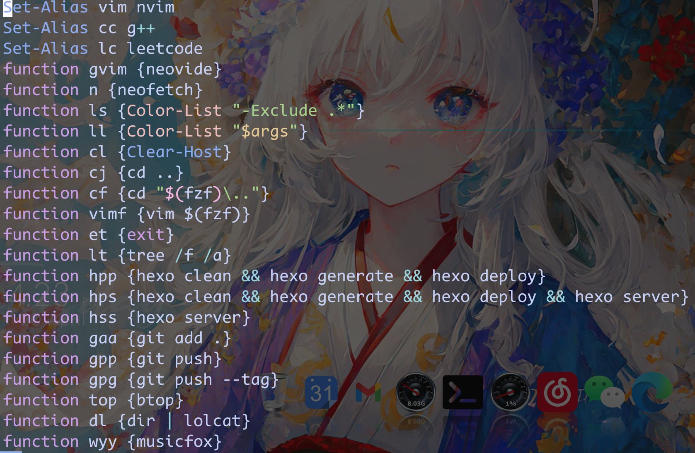

# 个人neovim配置的按键说明

leader键为`‘,’`（逗号）用于组合快捷键比如`,q`用于代替`:q<CR>(回车)`（退出）可以自行更改

## vim的四种模式

1. normal（普通模式）--- n
2. insert（输入模式）--- i
3. visual（可视模式）--- v
4. command（命令模式）--- c
5. term（终端模式）--- t

正常打开进入n模式按`a`或者`i`进入i模式

n模式按`v`进入v模式

n模式按`:`进入c模式

v、i、c模式按`esc`退回n模式

这里就不细说了可以先去看看vim的基础的键位图

如`u`撤销`Ctrl+r`取消撤销等等

## 按键说明

这里就按着配置文件中的keybindings.lua的文件进行说明

|     模式     |             按键              |                    功能                    |
| :----------: | :---------------------------: | :----------------------------------------: |
|     n/v      |               $               |                 跳转到行尾                 |
|     n/v      |              g_               |                 跳转到行尾                 |
|      c       |            Ctrl+j             |                  向下移动                  |
|      c       |            Ctrl+k             |                  向上移动                  |
|     n/v      |            Ctrl+j             |            向下移动5行相当于5j             |
|     n/v      |            Ctrl+k             |            向上移动5行相当于5k             |
|     n/v      |            Ctrl+d             |              向下移动半个屏幕              |
|     n/v      |            Ctrl+u             |              向上移动半个屏幕              |
|      v       |               <               |                  向前缩进                  |
|      v       |               >               |                  向后缩进                  |
|      v       |           J（大写）           |             向下移动选中行内容             |
|      v       |           K（大写）           |             向上移动选中行内容             |
|      n       |               w               |                    保存                    |
|      n       |              wq               |                  保存退出                  |
|      n       |           \<leader\>q           |                    退出                    |
|      i       |              jj               |             相当于esc回到n模式             |
|      i       |            ctrl+j             |              将光标移动到行首              |
|      i       |            ctrl+l             |              将光标移动到行尾              |
|              |                               |                                            |
|   分屏操作   |           分屏操作            |                  分屏操作                  |
|              |           分屏操作            |                                            |
|      n       |              sv               |                  垂直分屏                  |
|      n       |              sb               |                  水平分屏                  |
|      n       |              sc               |                关闭当前窗口                |
|      n       |              so               |                关闭其他窗口                |
|      n       |      大写HJKL(上下左右)       |                窗口之间跳转                |
|      n       |         \<leader\>+hjkl         |                窗口之间跳转                |
|      n       |         Ctrl+方向右键         |             分屏左右比例向右1              |
|      n       |         Ctrl+方向左键         |             分屏左右比例向左1              |
|      n       |              s,               |             分屏左右比例向右5              |
|      n       |              s.               |             分屏左右比例向左5              |
|      n       |              s=               |                分屏相等比例                |
|      n       |              sj               |             分屏上下比例向下1              |
|      n       |              sk               |             分屏上下比例向上1              |
|      n       | Ctrl+方向上键（已被插件占用） |             分屏上下比例向上1              |
|      n       | Ctrl+方向下键（已被插件占用） |             分屏上下比例向下1              |
|      n       |              ss               |        在nvim下打开终端（默认pwsh）        |
|      n       |              stb              |                水平打开终端                |
|      n       |              stv              |                垂直打开终端                |
|              |                               |                                            |
| 插件的快捷键 |         插件的快捷键          |                插件的快捷键                |
|              |         插件的快捷键          |                                            |
|      n       |              zz               |                  函数折叠                  |
|      n       |            Z(大写)            |                    打开                    |
|      n       |             <F8>              |                  大纲打开                  |
|      n       |          \<leader\>mb           |              markdown预览打开              |
|      n       |          \<leader\>me           |              markdown预览关闭              |
|      n       |           \<leader\>w           |                 单词间跳转                 |
|      n       |           \<leader\>f           |                 vim中的lf                  |
|              |                               |                                            |
|              |                               |                  标签切换                  |
|      n       |           Alt+h、l            |               左右标签的切换               |
|      n       |              xx               |                关闭当前标签                |
|      n       |    \<leader\>xh、xl、xo、xp     |         关闭左、右、其他、选中标签         |
|              |              xc               |     关闭当前标签，以及窗口效果是xx+sc      |
|              |           其他插件            |                                            |
|      v       |          选中单词+fy          |                    翻译                    |
|      n       |            Ctrl+f             |                全局模糊搜索                |
|      n       |            Ctrl+p             |              当前目录模糊搜索              |
|              |     模糊搜索中输入模式下      |                                            |
|              |         Ctrl+j/n、k/p         |                上下选择文件                |
|              |            Ctrl+c             |                  关闭窗口                  |
|              |           Ctrl+u、d           |              预览窗口上下滚动              |
|      n       |            gcc/gbc            |                 注释快捷键                 |
|      v       |             gc/gb             |                 注释快捷键                 |
|     n/v      |            Ctrl+/             |                 注释快捷键                 |
|      n       |            Ctrl+s             | 格式化代码（前提要有格式化软件）用的format |
|      n       |           \<leader\>g           |                  纯净模式                  |
|      v       |           \<leader\>h           |              选中部分纯净模式              |
|      n       |           \<leader\>s           |                lsp的格式化                 |
|      n       |              cm               |                重命名函数等                |
|      n       |              gd               |                函数定义跳转                |
|      n       |              gh               |                  代码提示                  |
|      n       |              gr               |                    刷新                    |
|      n       |              gp               |                显示报错信息                |
|      n       |            g+j、k             |             上、下一处报错信息             |
|              |                               |                                            |
|              |                               |                                            |
|              |      编译运行默认用的g++      |                                            |
|      n       |             <F5>              |                    编译                    |
|      n       |             <F4>              |                  调试编译                  |

| 文件树操作 |          文件树操作           |           文件树操作           |
| :--------: | :---------------------------: | :----------------------------: |
|            |          文件树操作           |                                |
|     n      |             Alt+m             |         打开关闭文件树         |
|            |               v               |        垂直分屏打开文件        |
|            |               b               |        水平分屏打开文件        |
|            |           R（大写）           |              刷新              |
|            |               a               |            新建文件            |
|            |               d               |      删除文件（谨慎操作）      |
|            |               r               |           重命名文件           |
|            |               e               |      重命名（不考虑类型）      |
|            |               y               |          复制文件名称          |
|            |               Y               |        复制文件相对路径        |
|            |              gy               |       复制文件夹绝对路径       |
|            |           I（大写）           | 查看文件信息（创建、修改时间） |
|            |               n               |         进入下一级目录         |
|            |               N（大写）       |         进入上一级目录         |
|            |               m               |              标记              |
|            |             Ctrl+n            |           新tab打开            |
|            |              tab              |            预览文件            |
|            |               q               |              退出              |
|            |               f               |            搜索文件            |
|            |          <CR>回车\o           |            打开文件            |
|            | <CR>回车<BS>删除（backspace） |         展开折叠文件夹         |
|            |              g？              |            查看帮助            |

| 模式 |                    按键                    |         功能         |
| :--: | :----------------------------------------: | :------------------: |
|      |                代码自动补全                |                      |
|      |                   Alt+.                    | 出现补全（默认出现） |
|      |                   Alt+,                    |       取消补全       |
|      |                 Ctrl+j、k                  | 补全上下选择回车确认 |
|      |                 Ctrl+u、d                  |     上下翻滚补全     |
|      |                    tab                     |     向下选择补全     |
|      |                 shift+tab                  |     向上选择补全     |
|      |                                            |                      |
|      |              三个不同位置终端              |                      |
|  n   |                     tt                     |       浮动终端       |
|  n   |                     tb                     |       右侧终端       |
|  n   |                     tc                     |       下方终端       |
|  n   |                     tg                     |   lazygit需要安装    |
|      |                                            |                      |
|      |            查看gitsigns修改记录            |                      |
|      | https://github.com/lewis6991/gitsigns.nvim |                      |
|      |                                            |                      |
|      |     调试用的nvim-dap的vscode的cpptools     |        c和c++        |
|      |                \<leader\>dc                |       开始继续       |
|      |                \<leader\>de                |         结束         |
|      |                \<leader\>dt                |        打断点        |
|      |                \<leader\>dT                |       取消断点       |
|      |                \<leader\>dh                |         弹窗         |
|      |                \<leader\>dj                |       stepOver       |
|      |                \<leader\>dk                |       stepOut        |
|      |                \<leader\>dl                |       stepInto       |

                   surround插件
    
    Old text                   Command         New text
    
    surround_words             ysiw)           (surround_words)
    make strings               ys$"            "make strings"
    [delete around me!]        ds]             delete around me!
    remove <b>HTML tags</b>    dst             remove HTML tags
    'change quotes'            cs'"            "change quotes"
    <b>or tag types</b>        csth1<CR>       <h1>or tag types</h1>
    delete(function calls)     dsf             function calls

多光标插件

- 创建光标选择单词Ctrl-N
- 创建垂直光标`Ctrl-Down/Ctrl-Up`
- 用n/N选择上一个下一个
- 用q跳过当前选择
- Q退出
- 用i、I、a、A开始输入

## pwsh的alias命令

